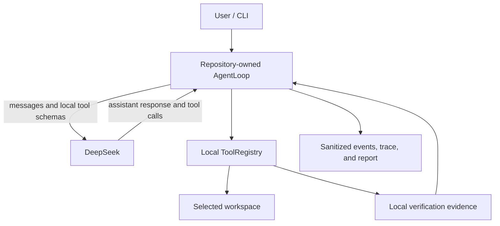

# ProofCoder

**An evidence-gated local coding agent whose completion claims are checked against local execution.**

[](https://github.com/mingbochen/proofcoder/actions/workflows/ci.yml)

ProofCoder lets DeepSeek decide what to inspect, change, and verify while repository-owned Python code controls the agent loop, conversation history, local tools, safety policy, retries, termination, and audit trail. File access and command execution happen locally inside a workspace selected by the user. A model's summary is never treated as proof that the task succeeded.

## Why ProofCoder

- **Repository-owned agent loop.** `AgentLoop`, message history, context selection, tool dispatch, retries, progress detection, and completion logic are implemented in this repository.
- **Seven local tools.** The model can list, search, read, create, replace, run approved commands, and request completion through a small typed interface.
- **Whole-batch preflight.** Every call in a model-produced tool batch is validated before any call in that batch can have a side effect.
- **Exact, local file safety.** Workspace containment, sensitive-path rules, bounded reads and writes, create-if-absent behavior, and exact counted replacement constrain file operations.
- **Default-deny commands.** Commands use argv with `shell=False`; only narrow test, build, static-check, workspace-Python, and read-only Git forms are accepted.
- **Evidence-gated completion.** Fresh local verification after the latest tracked edit is required for `completed_verified`.
- **Bounded operation.** Context, API attempts, model steps, wall time, consecutive failures, output, and repeated no-progress behavior all have limits.
- **Sanitized evidence.** Ordered events, JSONL traces, command audits, diffs, verification, and termination summaries are bounded and redacted.
- **Isolated repeated evaluation.** Real-model fixtures run in separate workspaces and are scored using independent snapshots and final validation.

ProofCoder does **not** use an agent framework or agent SDK. It does not use a provider Files API, Code Interpreter, hosted shell, hosted file tool, or provider-hosted code execution. The `openai` package is used only for API communication and native tool-calling protocol objects.

## Architecture



DeepSeek proposes actions; the response first returns to `AgentLoop`, which validates the complete call batch and invokes `ToolRegistry` locally. The provider never directly operates on the workspace. See [Design](docs/DESIGN.md) for component responsibilities, protocol flow, and trade-offs.

## Requirements

- Python 3.11 or newer. The project and CI currently use Python 3.11.9.
- [uv](https://docs.astral.sh/uv/) for locked dependency and environment management.
- Windows or Linux. CI exercises `windows-latest` and `ubuntu-latest`; this is not a claim about every OS or distribution.
- A DeepSeek credential for online doctor, `run`, and real `eval` only. Offline doctor and trace inspection do not require it.

## Installation

Clone the repository and install the locked runtime dependencies:

```text
git clone https://github.com/mingbochen/proofcoder.git
cd proofcoder
uv lock --check
uv sync --locked
```

The ordinary runtime needs only the default dependency set. Install the development extra when running the repository's tests, linters, or scanners:

```text
uv sync --locked --extra dev
```

Dependency synchronization may contact the configured package source. Neither command should regenerate or update `uv.lock` when the lock is valid.

## Configuration

[`.env.example`](.env.example) defines the supported fields:

| Variable | Purpose | Example default |
| --- | --- | --- |
| `DEEPSEEK_API_KEY` | Provider credential required in online mode | empty; supply your own value |
| `DEEPSEEK_BASE_URL` | OpenAI-compatible endpoint | `https://api.deepseek.com` |
| `DEEPSEEK_MODEL` | Model identifier | `deepseek-v4-flash` |
| `DEEPSEEK_REASONING_EFFORT` | Requested reasoning effort | `high` |

Create a local configuration file with the command for your shell.

PowerShell:

```powershell
Copy-Item .env.example .env
```

POSIX shell:

```sh
cp .env.example .env
```

Fill in your own credential locally. Do not display it, put it in command-line arguments, or commit `.env`; the repository's ignore rules exclude `.env` and `.env.*` while retaining `.env.example`.

ProofCoder itself reads configuration from the process environment and does not automatically parse `.env`. The examples below use uv's supported `--env-file .env` option to inject those values into the child process. The credential necessarily exists in the local ProofCoder process and provider request, but it is excluded from model-callable subprocess environments and ordinary traces, reports, and logs by application controls.

## Quick Start

First verify the local installation without reading an API key or contacting the provider:

```text
uv run --offline proofcoder doctor --offline
```

The command exits `0` when Python, the package import, and current-directory access checks pass. Online doctor additionally validates provider connectivity:

```text
uv run --locked --env-file .env proofcoder doctor
```

For a first real run, use a disposable sibling workspace rather than the ProofCoder repository or another high-value directory:

```text
mkdir ../proofcoder-demo
uv run --locked --env-file .env proofcoder run --workspace ../proofcoder-demo "Create hello.py that prints 'Hello, ProofCoder!', add a unittest, and run the test."
```

`--workspace` is the file authority boundary for ProofCoder's ordinary tools. Each run creates protected `.proofcoder` runtime artifacts inside that workspace for traces and command audits; these paths are unavailable to model file tools. The boundary is application policy, not process isolation, so do not experiment directly in an untrusted or irreplaceable workspace.

`run` defaults to 8 assistant responses, 600 seconds, a 262144-byte context budget, 5 consecutive failed batches, and up to 3 API attempts per model response. Use `proofcoder run --help` for their bounded overrides. Exit code `0` represents verified completion or a locally observed no-change completion, `3` unverified changes, and `4` an explicit blocked result. Other failures are nonzero; interruption returns `130`.

## Local Tools

| Tool | Purpose | Core boundary |
| --- | --- | --- |
| `list_files` | Return a sorted workspace inventory | Omits sensitive/internal paths and bounds depth and entry count |
| `search_text` | Search literal text or a regular expression | Skips sensitive, binary, oversized, linked, and runtime files; results are capped |
| `read_file` | Read numbered UTF-8 line ranges | Rejects sensitive, binary, and oversized files; each response is bounded |
| `create_file` | Create one UTF-8 file | Parent must exist and an existing file, directory, or link is never overwritten |
| `replace_in_file` | Replace exact text in an existing file | Match count must equal `expected_replacements`; failed or ambiguous matches do not mutate |
| `run_command` | Run an approved local check or workspace script | argv-only, `shell=False`, default-deny policy, filtered environment, timeout, and bounded output |
| `finish_task` | Request completion or report a blocker | Runs no claimed verification and cannot override local evidence |

All seven tools are implemented and executed locally. Expected failures return structured results so the model can change its approach; valid calls in a fully valid batch execute synchronously in model-provided order.

## Completion Semantics

ProofCoder distinguishes four completion states:

- `completed_verified`: built-in file changes exist and a fresh successful test, build, or static check was accepted after the latest change.
- `completed_unverified`: tracked changes exist, but no qualifying verification remains fresh.
- `completed_no_changes`: no built-in create or replace operation recorded a change.
- `blocked`: the sole `finish_task` call supplied an explicit blocker reason.

The model's summary, changed-file list, and verification claim are explanatory input, not facts. `finish_task` never executes the command it claims. A successful built-in edit invalidates older verification, and only an actually executed, zero-exit, non-timeout test/build/static-check result can restore verified status.

Normal runs track changes reported by the built-in create and replace tools. Real evaluation uses a stronger evidence boundary: independent before/after filesystem snapshots also detect changes made by workspace processes, then enforce required and allowed file sets.

## Trace and Replay

List local runs and display one run by the ID printed by `run`:

```text
uv run --offline proofcoder trace list --workspace ../proofcoder-demo
uv run --offline proofcoder trace show --workspace ../proofcoder-demo <run_id>
```

Trace commands are local and do not load provider credentials. The stored JSONL contains sanitized ordered events plus bounded action, diff, verification, statistics, completion, and termination summaries. It deliberately omits complete hidden reasoning, full file bodies, full command output, raw environments, and provider request/response bodies.

`trace show` returns `0` only for a complete, valid trace and returns nonzero for malformed, truncated, missing-termination, or recorder-incomplete evidence. A run with `trace_complete=false` may still have performed work, but its trace must not be treated as complete evaluation evidence.

## Evaluation

Real evaluation calls the configured provider and may incur usage charges:

```text
uv run --locked --env-file .env proofcoder eval --repeat 3
```

The default repeat count is 3, and the default fixture selection is all fixtures under `evals/fixtures`. Repeat `--fixture <fixture-id>` to select one or more fixtures. Each attempt uses an isolated workspace, initial-failure evidence, independent final validation, exact change-scope checks, and a complete trace requirement. Results are written below the ignored `.proofcoder/evals` directory.

The dated real-model results and failure analysis are in the [Evaluation Report](docs/EVAL_REPORT.md). Those small-fixture results are bounded evidence, not a general success-rate claim. Real evaluation is opt-in and is not run by CI; CI configures no provider key and runs only offline validation and scanning after dependency synchronization.

## Development and Verification

These commands mirror the cross-platform CI workflow:

```text
uv lock --check
uv sync --locked --extra dev
uv run --offline ruff format --check .
uv run --offline ruff check .
uv run --offline pytest --cov=proofcoder --cov-report=term-missing
uv run --offline proofcoder doctor --offline
uv run --offline python scripts/compliance_check.py --format json
uv run --offline python scripts/secret_scan.py --format json
```

The lock check and dependency synchronization are separate from offline validation: `uv sync` may access package sources, while each subsequent `uv run --offline` refuses network dependency resolution. The secret scanner covers Git-visible working-tree files, index blobs, and all reachable history within its declared bounds. Static scanning, offline tests, and CI success provide reviewable evidence; they are not formal proofs of security or correctness.

## Security Boundaries

- ProofCoder enforces an application policy, not an OS or kernel sandbox.
- An allowed workspace Python script runs with the current user's authority and can act outside file-tool policy.
- Optional accelerated search trusts an operator-provided external `ripgrep` selected through `PATH`; executable provenance remains the operator's responsibility.
- Filesystem checks reduce but cannot eliminate time-of-check/time-of-use races.
- The provider, dependencies, package sources, Python, Git, external executables, operating system, and CI runner remain trust and supply-chain boundaries.
- Redaction and secret scanning are bounded and pattern based; unknown, encoded, fragmented, ignored, unreachable, or external secrets may be missed.
- A complete local verification proves the observed command result and freshness, not semantic correctness or absence of every side effect.

Use a low-privilege, low-quota credential, review workspace scripts before execution, and preserve the ignore rules. See the [Threat Model](docs/THREAT_MODEL.md) and [Compliance Evidence](docs/COMPLIANCE.md) for controls, residual risks, and review evidence.

## Documentation

| Document | Purpose |
| --- | --- |
| [Design](docs/DESIGN.md) | Implemented architecture, protocol, components, and trade-offs |
| [Threat Model](docs/THREAT_MODEL.md) | Assets, trust boundaries, abuse cases, mitigations, and residual risks |
| [Compliance Evidence](docs/COMPLIANCE.md) | Project-redline, dependency, call-chain, CI, and scanning evidence |
| [Evaluation Report](docs/EVAL_REPORT.md) | Dated real-model fixture results, failure diagnosis, and limitations |
| [Development Specification](docs/DEVELOPMENT_SPEC.md) | Normative scope, architecture, security rules, and acceptance criteria |

## Project Status and License

ProofCoder is a bounded engineering project and should not be described as production-ready or fully secure. No `LICENSE` file is currently included, so this README makes no license grant.
