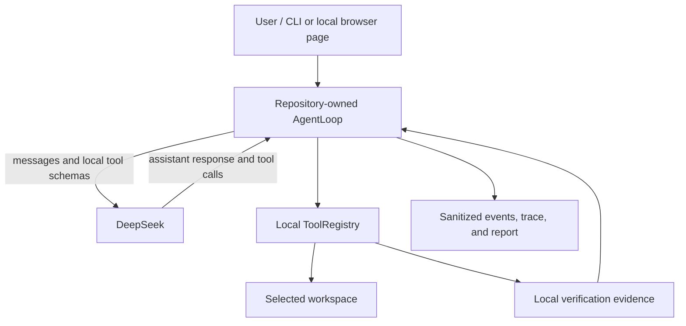

# ProofCoder

**An evidence-gated local coding agent whose completion claims are checked against local execution.**

[](https://github.com/mingbochen/proofcoder/actions/workflows/ci.yml)

ProofCoder lets DeepSeek decide what to inspect, change, and verify while repository-owned Python code controls the agent loop, conversation history, local tools, safety policy, retries, termination, and audit trail. File access and command execution happen locally inside a workspace selected by the user. A model's summary is never treated as proof that the task succeeded.

## Why ProofCoder

- **Repository-owned agent loop.** `AgentLoop`, message history, context selection, tool dispatch, retries, progress detection, and completion logic are implemented in this repository.
- **Seven local tools.** The model can list, search, read, create, replace, run approved commands, and request completion through a small typed interface.
- **Whole-batch preflight.** Every call in a model-produced tool batch is validated before any call in that batch can have a side effect.
- **Exact, local file safety.** Workspace containment, sensitive-path rules, bounded reads and writes, create-if-absent behavior, and exact counted replacement constrain file operations.
- **Default-deny commands.** Commands use argv with `shell=False`; only narrow test, build, static-check, workspace-Python, and read-only Git forms are accepted.
- **Evidence-gated completion.** Fresh local verification after the latest tracked edit is required for `completed_verified`.
- **Bounded operation.** Context, API attempts, model steps, wall time, consecutive failures, output, and repeated no-progress behavior all have limits.
- **Sanitized evidence.** Ordered events, JSONL traces, command audits, diffs, verification, and termination summaries are bounded and redacted.
- **Isolated repeated evaluation.** Real-model fixtures run in separate workspaces and are scored using independent snapshots and final validation.

ProofCoder does **not** use an agent framework or agent SDK. It does not use a provider Files API, Code Interpreter, hosted shell, hosted file tool, or provider-hosted code execution. The `openai` package is used only for API communication and native tool-calling protocol objects.

## Architecture



DeepSeek proposes actions; the response first returns to `AgentLoop`, which validates the complete call batch and invokes `ToolRegistry` locally. The provider never directly operates on the workspace. See [Design](docs/DESIGN.md) for component responsibilities, protocol flow, and trade-offs.

## Requirements

- Python 3.11 or newer. The project and CI currently use Python 3.11.9.
- [uv](https://docs.astral.sh/uv/) for locked dependency and environment management.
- Git 2.44 or newer to run the secret scanner's `history` scope locally. With older Git that scope fails with `GIT_OUTPUT_ERROR`; use `--scope working-tree --scope index` instead. The GitHub-hosted CI runners scan all three scopes.
- Windows or Linux. CI exercises `windows-latest` and `ubuntu-latest`; this is not a claim about every OS or distribution.
- A DeepSeek credential for online doctor, `run`, and real `eval` only. Offline doctor and trace inspection do not require it.

## Installation

Clone the repository and install the locked runtime dependencies:

```text
git clone https://github.com/mingbochen/proofcoder.git
cd proofcoder
uv lock --check
uv sync --locked
```

The ordinary runtime needs only the default dependency set. Install the development extra when running the repository's tests, linters, or scanners:

```text
uv sync --locked --extra dev
```

Dependency synchronization may contact the configured package source. Neither command should regenerate or update `uv.lock` when the lock is valid.

## Configuration

[`.env.example`](.env.example) defines the supported fields:

| Variable | Purpose | Example default |
| --- | --- | --- |
| `DEEPSEEK_API_KEY` | Provider credential required in online mode | empty; supply your own value |
| `DEEPSEEK_BASE_URL` | OpenAI-compatible endpoint | `https://api.deepseek.com` |
| `DEEPSEEK_MODEL` | Model identifier | `deepseek-v4-flash` |
| `DEEPSEEK_REASONING_EFFORT` | Requested reasoning effort | `high` |

Create a local configuration file with the command for your shell.

PowerShell:

```powershell
Copy-Item .env.example .env
```

POSIX shell:

```sh
cp .env.example .env
```

Fill in your own credential locally. Do not display it, put it in command-line arguments, or commit `.env`; the repository's ignore rules exclude `.env` and `.env.*` while retaining `.env.example`.

ProofCoder itself reads configuration from the process environment and does not automatically parse `.env`. The examples below use uv's supported `--env-file .env` option to inject those values into the child process. The credential necessarily exists in the local ProofCoder process and provider request, but it is excluded from model-callable subprocess environments and ordinary traces, reports, and logs by application controls.

## Quick Start

First verify the local installation without reading an API key or contacting the provider:

```text
uv run --offline proofcoder doctor --offline
```

The command exits `0` when Python, the package import, and current-directory access checks pass. Online doctor additionally validates provider connectivity:

```text
uv run --locked --env-file .env proofcoder doctor
```

For a first real run, use a disposable sibling workspace rather than the ProofCoder repository or another high-value directory:

```text
mkdir ../proofcoder-demo
uv run --locked --env-file .env proofcoder run --workspace ../proofcoder-demo "Create hello.py that prints 'Hello, ProofCoder!', add a unittest, and run the test."
```

`--workspace` is the file authority boundary for ProofCoder's ordinary tools. Each run creates protected `.proofcoder` runtime artifacts inside that workspace for traces and command audits; these paths are unavailable to model file tools. The boundary is application policy, not process isolation, so do not experiment directly in an untrusted or irreplaceable workspace.

Commands that need confirmation are refused unless you ask to be asked:

```text
uv run --locked --env-file .env proofcoder run --workspace ../proofcoder-demo \
  --approval on-risk --command-policy ../proofcoder-demo/proofcoder.toml "..."
```

`--approval on-risk` prints the full argv, working directory and timeout and waits for an answer; anything but an explicit yes refuses, and standard input that is not a terminal refuses immediately rather than assuming. `--command-policy` is the only way a project policy takes effect: a `proofcoder.toml` sitting in the workspace is reported and ignored until you name it. The time spent waiting for you is not charged against `--max-seconds`.

`run` defaults to 8 assistant responses, 600 seconds, a 262144-byte context budget, 5 consecutive failed batches, and up to 3 API attempts per model response. Use `proofcoder run --help` for their bounded overrides. Exit code `0` represents verified completion or a locally observed no-change completion, `3` unverified changes, and `4` an explicit blocked result. Other failures are nonzero; interruption returns `130`.

## Run Checkpoints

Before its first model call, every run records a checkpoint: a content-addressed copy of the workspace baseline under the ignored `.proofcoder/checkpoints/<run_id>` directory. The baseline is taken before any tool exists to be called, so it also covers writes made by an allowed workspace script, a build, or a test, not only writes made by ProofCoder's own file tools.

A checkpoint records what it does not cover, and those gaps are real:

| Not covered | Why |
| --- | --- |
| `.env`, private keys, certificates, and other credential paths | Neither their content nor a digest of it is stored, so a checkpoint never becomes a copy of your credentials. Changes to them are reported instead |
| Files larger than 1 MiB | Recorded by metadata only; a change is detected and reported, but the content is not stored |
| `.git`, virtual environments, `node_modules`, caches, and `.proofcoder` | Outside the captured scope, as they are for the file tools |
| Symbolic links and anything outside the workspace | Never followed and never captured; a workspace script still runs with your full authority |

The capture is a precondition, not a convenience: if it fails or the workspace exceeds the checkpoint limits, the run ends as `checkpoint_error` before contacting the provider. `proofcoder run --no-checkpoint` starts without one, and then nothing the run writes can be undone. The most recent three checkpoints are kept, subject to a total size limit; pruning happens before the next capture and never removes a run trace.

### Undoing a run

```text
uv run --offline proofcoder rollback list --workspace ../proofcoder-demo
uv run --offline proofcoder rollback show --workspace ../proofcoder-demo <run_id>
uv run --offline proofcoder rollback apply --workspace ../proofcoder-demo <run_id>
uv run --offline proofcoder rollback delete --workspace ../proofcoder-demo <run_id>
```

`show` prints everything a rollback would change and writes nothing: files to restore, files to recreate, paths to delete, directories to add or remove, and every path that is reported rather than restored. Each entry is labelled `(tool)` when the run's own file tools wrote it, so a change made by a workspace script is distinguishable from one ProofCoder made itself.

`apply` prints that same plan, asks for confirmation, and only then writes. `--yes` skips the prompt for unattended use; without it, a non-terminal standard input refuses rather than assuming either answer. Exit code `0` means the plan was applied or there was nothing to undo, `3` that confirmation was declined and nothing changed, `1` that at least one path could not be restored — each such path is printed with its error code, because a partly restored workspace must never look like a finished one. Applying the same rollback twice is a no-op.

A rollback is a separate operation against a finished run, so it records its own trace with a new run ID whose `rollback` event names the run it undid; `proofcoder trace list` shows it with status `rollback`. Rollback commands are local and load no provider credentials.

The browser interface offers the same thing on the card that closes a run; see below.

## Browser Interface

`proofcoder serve` presents the same bounded run in a local web page, so a task can be
started, watched, stopped, and replayed without remembering command-line flags:

```text
uv run --locked --env-file .env proofcoder serve --workspace ../proofcoder-demo --open
```

The command prints the loopback URL it bound. The page offers a workspace picker, an
example-task composer, live rendering of model messages, tool calls, diffs, verification
results and the final completion badge, a per-workspace run history that replays stored
traces, an environment self-check, and the same bounded run overrides `run` accepts. It
is bilingual (Chinese and English) and follows the browser's light or dark theme.

The interface is presentation only. It adds no agent behaviour, no new runtime
dependency, and no second completion rule: it starts `AgentLoop` exactly as `run` does,
streams the same sanitized events the JSONL trace receives, and shows the completion
status the local run reported.

The card that closes a run carries a rollback entry. Opening it shows the same plan the
command line prints — what would be restored, recreated, deleted, which directories
move, which paths ProofCoder's own tools wrote, and every path reported rather than
restored — and only a second, explicit confirmation applies it. A browser has no
terminal to be asked at, so the approval is bound to the plan it was given for: the
server issues a digest with the plan and refuses any request whose digest no longer
matches the plan that would run now, returning the new plan to be reviewed instead. A
workspace with a run in progress refuses outright. The run's own checkpoint coverage is
shown while the run streams, so what is recoverable is visible before anything needs
recovering.

| Option | Purpose |
| --- | --- |
| `--host` | Interface to bind; defaults to `127.0.0.1` |
| `--port` | TCP port, `0` for an ephemeral port; defaults to `8765` |
| `--workspace` | Directory offered as the initial workspace; defaults to the current directory |
| `--no-browse` | Disable the directory picker so only typed workspace paths are accepted |
| `--open` | Open the URL in the default browser after binding |

Serving the agent to a browser exposes local file and command authority to whatever can
reach that page, so the server applies four local controls:

- It binds loopback by default, and prints a warning when asked to bind anything else.
- Every `/api` request must carry a per-process session token that is written only into
  the page served from this origin; it is never printed, logged, or placed in a URL.
- `Host` and `Origin` must match the bound address, which rejects DNS-rebinding and
  cross-site requests from other pages the browser has open.
- The page loads no external script, style, font, or image, and is served under a strict
  content-security policy.

These are local access controls, not an operating-system sandbox. Do not bind a
non-loopback interface on an untrusted network, and keep using a disposable workspace.

Stopping a run from the page is cooperative: the loop checks for the request between
model calls and between tool calls, so an in-flight provider request or local command
finishes first and the run then terminates as `interrupted`.

The interface was added under [ADR-0002](docs/adr/0002-local-browser-interface.md), which
removed the graphical-interface non-goal from the Development Specification. It touches
none of the project redlines in section 2: no agent framework or SDK, no provider-hosted
execution or file access, no new runtime dependency, and no agent logic outside the
existing repository-owned loop.

The page shows the tasks for a workspace as one thread, but each task is still an
independent run: the model does not see earlier tasks. Multi-turn sessions are a later
stage in the [roadmap](docs/ROADMAP.md).

## Local Tools

| Tool | Purpose | Core boundary |
| --- | --- | --- |
| `list_files` | Return a sorted workspace inventory | Omits sensitive/internal paths and bounds depth and entry count |
| `search_text` | Search literal text or a regular expression | Skips sensitive, binary, oversized, linked, and runtime files; results are capped |
| `read_file` | Read numbered UTF-8 line ranges | Rejects sensitive, binary, and oversized files; each response is bounded |
| `create_file` | Create one UTF-8 file, or replace one with `overwrite` | Parent must exist; an existing file is replaced only with `overwrite: true`, and directories and links never are |
| `replace_in_file` | Replace exact text in an existing file | Match count must equal `expected_replacements`; failed or ambiguous matches do not mutate |
| `patch_file` | Apply several exact replacements to one file at once | Every edit is validated in memory first: one bad match fails the call and leaves the file untouched |
| `make_directory` | Create a directory and any missing parents | Refused when the path exists as a file or a link; an existing directory is reported, not recreated |
| `delete_path` | Delete one file, one empty directory, or one link | Never recursive; a non-empty directory is refused, and a link is removed without following it |
| `move_path` | Move or rename one file or directory | The destination must not exist; nothing is ever overwritten |
| `run_command` | Run an approved local check or workspace script | argv-only, `shell=False`, default-deny policy with an allow/confirm/deny decision, filtered environment, timeout, and bounded output |
| `finish_task` | Request completion or report a blocker | Runs no claimed verification and cannot override local evidence |

All eleven tools are implemented and executed locally. Expected failures return structured results so the model can change its approach; valid calls in a fully valid batch execute synchronously in model-provided order.

Three of them destroy content in a single call: `delete_path`, `move_path`, and `create_file` with `overwrite: true`. Those three refuse to run when the run has no checkpoint, because a change that cannot be undone should not be available without the thing that undoes it. A run started with `--no-checkpoint` keeps every other tool, including the ones that create files and edit them.

## Completion Semantics

ProofCoder distinguishes four completion states:

- `completed_verified`: built-in file changes exist and a fresh successful test, build, or static check was accepted after the latest change.
- `completed_unverified`: tracked changes exist, but no qualifying verification remains fresh.
- `completed_no_changes`: no built-in create or replace operation recorded a change.
- `blocked`: the sole `finish_task` call supplied an explicit blocker reason.

The model's summary, changed-file list, and verification claim are explanatory input, not facts. `finish_task` never executes the command it claims. A successful built-in edit invalidates older verification, and only an actually executed, zero-exit, non-timeout test/build/static-check result can restore verified status.

Normal runs track changes reported by the built-in create and replace tools. Real evaluation uses a stronger evidence boundary: independent before/after filesystem snapshots also detect changes made by workspace processes, then enforce required and allowed file sets.

## Trace and Replay

List local runs and display one run by the ID printed by `run`:

```text
uv run --offline proofcoder trace list --workspace ../proofcoder-demo
uv run --offline proofcoder trace show --workspace ../proofcoder-demo <run_id>
```

Trace commands are local and do not load provider credentials. The stored JSONL contains sanitized ordered events plus bounded action, diff, verification, checkpoint, statistics, completion, and termination summaries. It deliberately omits complete hidden reasoning, full file bodies, full command output, raw environments, and provider request/response bodies.

`trace show` returns `0` only for a complete, valid trace and returns nonzero for malformed, truncated, missing-termination, or recorder-incomplete evidence. A run with `trace_complete=false` may still have performed work, but its trace must not be treated as complete evaluation evidence.

## Evaluation

Real evaluation calls the configured provider and may incur usage charges:

```text
uv run --locked --env-file .env proofcoder eval --repeat 3
```

Two fixtures declare `verify_rollback`: `rollback-word-wrap`, whose solution rewrites one file, and `cleanup-text-helpers`, whose solution renames one module and deletes another, so that the undo has to recreate deleted files and remove created ones rather than only restore edited text. For them the runner does one extra step after the usual scoring: it rolls the attempt back and compares the workspace file-by-file with the snapshot taken before the agent started. An incomplete rollback, a workspace that does not return to that baseline, or a run with no usable checkpoint each become their own failure reason, and the attempt's record carries what was restored and what was not.

One fixture, `nodejs-word-count`, is not a Python project: its tests run under Node's own test runner, which the built-in command policy does not know. It ships a `proofcoder.toml` and its `fixture.json` names it, and that naming is the authorization — `fixture.json` is never copied into the attempt workspace, so the workspace still grants itself nothing. Evaluation always runs with approval mode `never`, so a fixture's validation command has to be an `allow` entry; a confirmable one would be refused with nobody to ask.

The default repeat count is 3, and the default fixture selection is all fixtures under `evals/fixtures`. Repeat `--fixture <fixture-id>` to select one or more fixtures. Each attempt uses an isolated workspace, initial-failure evidence, independent final validation, exact change-scope checks, and a complete trace requirement. Results are written below the ignored `.proofcoder/evals` directory.

The dated real-model results and failure analysis are in the [Evaluation Report](docs/EVAL_REPORT.md), whose section 12 covers the two rollback fixtures and section 14 the Node fixture. Those small-fixture results are bounded evidence, not a general success-rate claim. Real evaluation is opt-in and is not run by CI; CI configures no provider key and runs only offline validation and scanning after dependency synchronization.

## Development and Verification

These commands mirror the cross-platform CI workflow:

```text
uv lock --check
uv sync --locked --extra dev
uv run --offline ruff format --check .
uv run --offline ruff check .
uv run --offline pytest --cov=proofcoder --cov-report=term-missing
uv run --offline proofcoder doctor --offline
uv run --offline python scripts/compliance_check.py --format json
uv run --offline python scripts/secret_scan.py --format json
```

The lock check and dependency synchronization are separate from offline validation: `uv sync` may access package sources, while each subsequent `uv run --offline` refuses network dependency resolution. The compliance checker also verifies that the registered tools match specification section 7 and the README tool table, that ADR records agree with the ADR index, that roadmap status values are valid, and that every path in the specification's directory layout exists. These checks compare names, paths, and status values, not the accuracy of prose. The secret scanner covers Git-visible working-tree files, index blobs, and all reachable history within its declared bounds. Static scanning, offline tests, and CI success provide reviewable evidence; they are not formal proofs of security or correctness.

## Security Boundaries

- ProofCoder enforces an application policy, not an OS or kernel sandbox.
- The command decision has three values. Most commands are allowed or refused outright; Git's local write subcommands are classified as needing confirmation. `proofcoder run --approval on-risk` asks at the terminal and the browser interface asks on the page; the default, `never`, refuses them without asking, which is also what evaluation uses. Git's network subcommands and `git config` are never confirmable: the first move repository content past anything a rollback reaches, and the second can set `core.hooksPath` or an alias that turns a later ordinary Git command into arbitrary execution.
- A project may extend the default-deny command set through a policy file, but that file is repository content and never authorizes itself: it applies only when `proofcoder run --command-policy <path>` names it, is frozen for the run once read, may not redeclare any executable the built-in policy already decides, and is refused by every write tool at any path named `proofcoder.toml`.
- The optional browser interface adds a local HTTP surface. Its loopback bind, session token, and Host/Origin checks are access controls on that surface, not isolation of the underlying file and command authority.
- An allowed workspace Python script runs with the current user's authority and can act outside file-tool policy. A run checkpoint covers such writes inside the workspace; it cannot cover anything the script does outside it.
- A checkpoint restores content within its captured scope. It is not a backup: credential paths, files over 1 MiB, ignored directories, and everything outside the workspace stay uncovered, and it protects nothing once `--no-checkpoint` is used.
- Optional accelerated search trusts an operator-provided external `ripgrep` selected through `PATH`; executable provenance remains the operator's responsibility.
- Filesystem checks reduce but cannot eliminate time-of-check/time-of-use races.
- The provider, dependencies, package sources, Python, Git, external executables, operating system, and CI runner remain trust and supply-chain boundaries.
- Redaction and secret scanning are bounded and pattern based; unknown, encoded, fragmented, ignored, unreachable, or external secrets may be missed.
- A complete local verification proves the observed command result and freshness, not semantic correctness or absence of every side effect.

Use a low-privilege, low-quota credential, review workspace scripts before execution, and preserve the ignore rules. See the [Threat Model](docs/THREAT_MODEL.md) and [Compliance Evidence](docs/COMPLIANCE.md) for controls, residual risks, and review evidence.

## Documentation

| Document | Purpose |
| --- | --- |
| [Design](docs/DESIGN.md) | Implemented architecture, protocol, components, and trade-offs |
| [Threat Model](docs/THREAT_MODEL.md) | Assets, trust boundaries, abuse cases, mitigations, and residual risks |
| [Compliance Evidence](docs/COMPLIANCE.md) | Project-redline, dependency, call-chain, CI, and scanning evidence |
| [Evaluation Report](docs/EVAL_REPORT.md) | Dated real-model fixture results, failure diagnosis, and limitations |
| [Development Specification](docs/DEVELOPMENT_SPEC.md) | Normative scope, architecture, security rules, stages, and acceptance criteria |
| [Roadmap](docs/ROADMAP.md) | Current stage, planned stages, and their status |
| [Architecture Decision Records](docs/adr/README.md) | Why scope and constraints changed, and the alternatives considered |
| [Changelog](CHANGELOG.md) | User-facing changes |

## Project Status and License

ProofCoder is a bounded engineering project and should not be described as production-ready or fully secure. Planned work and its status are tracked in the [roadmap](docs/ROADMAP.md). ProofCoder is licensed under the [Apache License 2.0](LICENSE).
