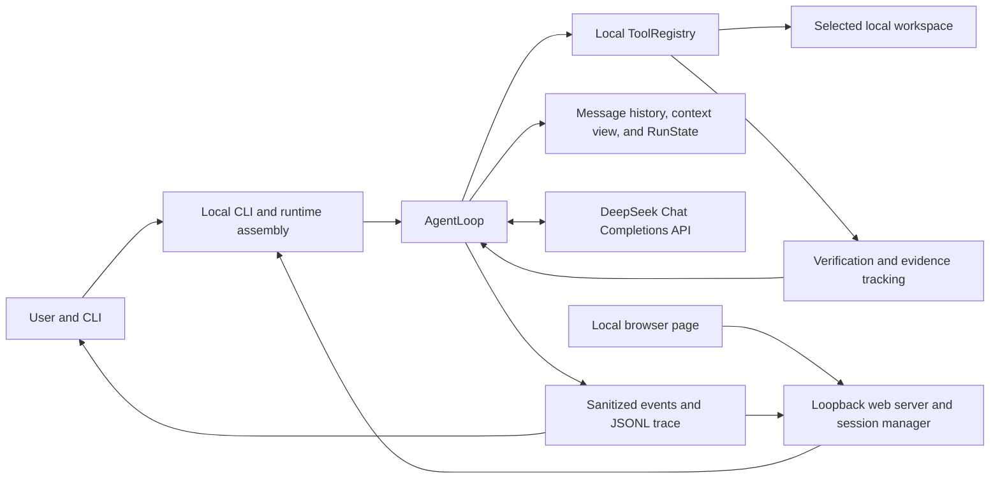
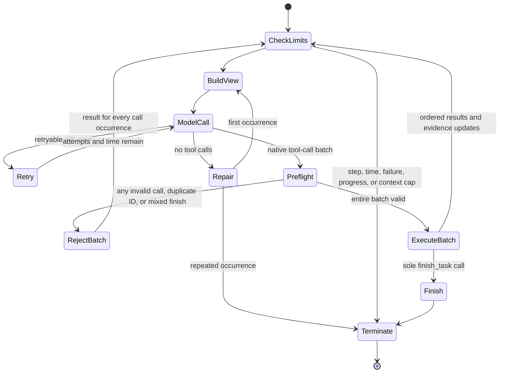

# ProofCoder Design

This document describes the implemented architecture of ProofCoder for technical reviewers, maintainers, and interviewers. It is subordinate to the normative [development specification](DEVELOPMENT_SPEC.md); where future code and this description diverge, the implementation and specification must be reconciled explicitly rather than papered over.

## 1. Purpose, goals, and non-goals

ProofCoder is a small, synchronous coding agent that lets a language model choose actions while trusted local Python code owns the action protocol, workspace access, safety checks, evidence, termination, and audit trail. The central design objective is not merely to produce a plausible answer. It is to make the path from a user task to a local change inspectable and to distinguish a model's claim of completion from completion supported by fresh local verification.

The primary goals are:

- execute a fixed set of file and command operations inside a user-selected workspace;
- preserve a complete protocol history while presenting a bounded, deterministic model context;
- validate an entire native tool-call batch before any call in that batch can have a side effect;
- turn expected failures into structured observations that the model can correct;
- derive changed-file, verification, progress, and completion facts in local code;
- emit a sanitized, ordered event stream and a durable trace when the trace sink remains healthy;
- evaluate runs in isolated workspaces with independent before/after snapshots and validation.

ProofCoder is deliberately not a general agent framework, multi-agent coordinator, GUI, provider plug-in platform, MCP host, operating-system sandbox, or automatic Git author. It does not outsource code execution or file access to a provider. It does not claim that path validation, an executable allowlist, redaction, or pattern-based scanning proves total security. These boundaries are also recorded in [COMPLIANCE.md](COMPLIANCE.md).

## 2. System context and trust boundary

The model decides which declared tool to request and supplies arguments. It never directly opens a file, launches a process, determines whether a path is safe, records a verified completion, or writes the trace. Those operations belong to local code. Provider libraries are restricted to API transport and native tool-call objects; the repository owns conversation history, validation, execution, retry policy, progress detection, completion status, and error handling.

The user-selected workspace is the file authority boundary. Internal runtime artifacts are kept below the workspace's protected .proofcoder directory, but that directory is not exposed through ordinary model file tools. Network contact occurs only through an explicitly online model client. File and command tools remain local.

## 3. Component responsibilities

| Component | Responsible for | Explicitly not responsible for | Main collaborators |
| --- | --- | --- | --- |
| [AgentLoop](../src/proofcoder/agent.py) | synchronous turn loop, model/tool protocol, whole-batch preflight, retries, progress limits, termination, final report | provider transport details, path policy, or independent evaluation | MessageHistory, ContextManager, ToolRegistry, RunState |
| [runtime assembly](../src/proofcoder/agent_runtime.py) | fresh registry with the seven tools, trace resources, the pre-run checkpoint, common run/eval loop construction, setup-failure trace | CLI parsing or tool policy implementation | CLI, eval runner, AgentLoop |
| [CLI](../src/proofcoder/cli.py) | doctor, run, eval, serve, trace, session, and rollback boundaries; workspace checks; the rollback confirmation gate; exit-code mapping; terminal rendering | deciding completion from model prose | configuration, runtime assembly, eval and trace readers |
| [browser runs](../src/proofcoder/web/runs.py), [API](../src/proofcoder/web/api.py), and [server](../src/proofcoder/web/server.py) | one worker thread per browser-started run, bounded event buffering, cooperative cancellation, the rollback plan and its digest-bound confirmation, the session routes, JSON routing, loopback bind, request token, Host/Origin checks, static page delivery | agent behavior, tool policy, or a second completion rule | runtime assembly, trace reader, the local browser page |
| [configuration](../src/proofcoder/config.py) and [DeepSeek client](../src/proofcoder/llm/deepseek.py) | environment-derived provider settings, synchronous Chat Completions transport, response normalization, API error classification | local retries in the SDK, tool execution, history ownership | AgentLoop and the provider |
| [protocol models](../src/proofcoder/protocol.py) and [history](../src/proofcoder/context.py) | typed messages/results, pairing each tool call with a result, preserving full history | context eviction policy or local facts | ContextManager and AgentLoop |
| [ContextManager](../src/proofcoder/context.py) | deterministic byte accounting, atomic interaction grouping, bounded API view, program-generated state summary | mutating the full history or summarizing with another model | MessageHistory and RunState |
| [RunState](../src/proofcoder/state.py), [verification](../src/proofcoder/verification.py), and [progress](../src/proofcoder/progress.py) | changed-file order, fresh verification, warnings/counters, repeated-action detection | inferring success from assistant text | AgentLoop and tool results |
| [ToolRegistry](../src/proofcoder/tools/registry.py) and [tool contract](../src/proofcoder/tools/base.py) | schema validation, defaults, preflight, execution envelope, structured errors | bypassing tool-specific safety rules | seven tool implementations and AgentLoop |
| [path safety](../src/proofcoder/safety/paths.py), [command policy](../src/proofcoder/safety/commands.py), [secret handling](../src/proofcoder/safety/secrets.py), and [write safety](../src/proofcoder/safety/writes.py) | path containment, sensitive-file rules, write limits, command allowlist, minimal subprocess environment, redaction | providing an OS sandbox or proving absence of all secrets | file, edit, search, and command tools |
| [checkpoint](../src/proofcoder/checkpoint.py) | content-addressed workspace baseline, capture scope and limits, rollback planning and application, retention pruning, trace payloads | deciding when a run rolls back, or covering anything outside the captured scope | runtime assembly, AgentLoop, trace reader |
| [session](../src/proofcoder/session.py) | storing one workspace's cross-run sessions, validating a stored session all-or-nothing, building a finished run's record, and assembling the bounded text a later run carries | deciding when a session applies, or contributing anything to run state | AgentLoop, RunResult, trace |
| [rollback](../src/proofcoder/rollback.py) | applying one plan as a recorded operation: its own run identifier, the rollback and termination events, and the shared exit-code mapping | deciding what to restore, or asking the user anything | checkpoint, trace, CLI, web sessions |
| [events](../src/proofcoder/events.py) and [trace](../src/proofcoder/trace.py) | sanitized bounded events, sequence/run identity, terminal/memory/composite sinks, append-only JSONL, strict trace reading | retaining hidden reasoning or complete file/command bodies | AgentLoop, CLI, eval runner |
| [evaluation core](../src/proofcoder/eval_core.py), [fixtures](../src/proofcoder/eval_fixtures.py), and [runner](../src/proofcoder/eval_runner.py) | isolated fixtures, snapshots, independent validation, strict success predicate, durable attempt/summary artifacts | treating an agent's finish claim as ground truth | shared runtime assembly and trace reader |

## 4. Runtime assembly and CLI boundaries

The production entry point is the console command defined in [pyproject.toml](../pyproject.toml), which reaches [cli.main](../src/proofcoder/cli.py). The run command resolves and validates the workspace, creates run and trace resources, loads online configuration, constructs the DeepSeek client, and calls the shared builder in [agent_runtime.py](../src/proofcoder/agent_runtime.py). Evaluation uses the same registry and loop builder so that benchmark execution does not quietly acquire a second runtime design.

The registry is new for each run and is assembled in a fixed order. A TraceRecorder is also run-scoped. If provider configuration or client construction fails after trace resources exist, runtime assembly can emit a minimal task/termination trace. If the trace path itself cannot be created, the CLI reports that setup failure without pretending a trace exists.

Runtime assembly also captures the run's checkpoint, after the trace exists and before the registry is handed to any loop. Ordering carries the guarantee: the baseline predates every write the run can perform, whether the writer is a built-in tool or a workspace script the run starts. A capture failure is returned on the resources rather than raised, so the same setup-termination path records it and the run ends as `checkpoint_error` instead of proceeding unprotected. AgentLoop receives the finished capture and reports it; it never captures or rolls back itself, which keeps rollback a user action against a finished run rather than something the model can reach.

The serve command reuses that same assembly. A browser-started run is one AgentLoop on one worker thread whose sanitized events fan out to the JSONL trace and to a bounded in-memory buffer the page long-polls. Because KeyboardInterrupt reaches only the main thread, the loop accepts an optional cancellation callback and polls it between model calls and between tool calls; the resulting termination is the existing interrupted reason rather than a new outcome. The web layer adds no runtime dependency: it is standard-library HTTP plus one static page. Its loopback default, per-process session token, and Host/Origin checks bound who may reach that surface; they do not change the file and command authority behind it.

The browser reaches rollback through the same function, with one addition the command line does not need. A terminal can be asked at the moment of the decision; a browser cannot, so an approval that arrives later has to prove which plan it is approving. The server issues a digest of the plan it displayed, recomputes the plan when the confirmation arrives, and refuses the request when the digests differ — returning the replacement plan rather than an error alone, so the caller reviews the change instead of retrying blindly. That turns "the operator saw this" into something the server can check rather than something it assumes. A workspace with a live run is refused outright: a rollback racing a running agent would restore files the agent is still writing.

A rollback is recorded as its own operation rather than as part of the run it undoes. The target run's trace was closed by its termination event, and a trace whose termination is not last is what the reader treats as damaged, so the rollback takes a fresh run identifier and names its target in the event payload instead. Both entry points go through the same function, so the command line and the browser record the same evidence for the same action. Confirmation is the CLI's responsibility, not the operation's: the plan is printed first, `--yes` is the explicit unattended path, and a non-terminal standard input refuses rather than assuming an answer. The rollback still runs when its trace cannot be opened — losing the record is worse than losing the recovery, but not a reason to leave the workspace as the run left it — and the missing record is reported through `trace_complete`.

The doctor command has distinct online and offline modes. Offline doctor validates local configuration and capabilities without requiring an API key or making a provider request. Online doctor performs the provider check. Trace list/show are local readers and do not load provider credentials. Run and real evaluation obtain credentials from process environment variables only when an online client is needed. Configuration representations hide the API key; events, errors, subprocess environments, and terminal output pass through additional sanitization. The necessary in-process credential is not described as nonexistent—only as excluded from inappropriate surfaces.

## 5. AgentLoop protocol

Each model response is normalized into a complete assistant message. Its native function calls and any reasoning_content are retained in the full local history. Reasoning content is sent back only while that assistant message remains in the bounded API view; it is not printed in ordinary terminal output or intentionally copied into the trace.

Native function calls are the only action protocol. Before execution, AgentLoop rejects duplicate call IDs and requires finish_task to be the sole call in its batch. ToolRegistry then parses arguments, checks the local schema, applies defaults, rejects unknown or ill-typed fields, and runs every tool's preflight. This happens for the full batch before the first side effect. If any call is invalid, no call executes and a structured result is appended for every call occurrence, preserving assistant/tool pairing. A valid batch executes synchronously in order, and each result is appended and emitted before the next call.

An assistant response with no tool call receives one local protocol-repair message. Repetition terminates as model_stopped. There is no free-standing, unbounded “correction budget”: correction is bounded by that single repair, the consecutive failed-batch cap, repeated-progress detection, API attempt limits, and the global step/time limits. A sole finish_task request ends the loop with a status derived by local state rather than by accepting the assistant's wording.

## 6. State, history, and context compression

MessageHistory is append-only for the run and enforces role order plus exact pending tool-result pairing. Full history is the audit-quality protocol record used by the loop; context compression never edits it.

ContextManager builds a separate API view. It always retains the initial system instruction and original user task, groups later assistant calls and their tool results atomically, and adds a deterministic state summary generated from RunState. When the configured byte budget is exceeded, it removes the oldest complete interaction groups until the target budget is met while retaining the configured recent groups. It never keeps an assistant tool request without its results, nor an orphan result. If the fixed prefix plus required recent context cannot fit, it raises a structured context-budget termination instead of sending a malformed request.

RunState records local facts: ordered changed paths reported by successful built-in create/replace tools, command observations, the latest accepted verification, warnings, and run counters. A later successful modification invalidates the previous verification. Context summaries expose bounded versions of those facts without asking the model to summarize itself. One residual boundary is important: normal run changed-file tracking is driven by built-in edit results; evaluation therefore uses independent filesystem snapshots to detect changes caused through other local processes.

A session adds the only data that crosses a run boundary, and it crosses in one direction only. The carry is assembled and bounded before the loop exists, is prefixed to the first user message rather than appended to the system instruction, and reaches no field of RunState. So the run that carries a session still starts with no changed files and no verification, and can reach `completed_verified` only through a command it runs itself; the earlier run's verification appears in the carried text marked expired, because that boundary is held by the empty state rather than by withholding the fact. Each carried record keeps the program's observations and the earlier run's own account of itself in separate labelled blocks: one half is program-recorded and the other is model-authored, and merged they would be indistinguishable. Trimming to the ceiling is deterministic and takes the oldest run's account first, then the oldest run entirely, so the newest conclusion survives longest.

## 7. The eleven local tools

The registry exposes exactly these tools:

1. [list_files](../src/proofcoder/tools/files.py) returns a sorted, bounded workspace inventory, with hidden files opt-in and sensitive/internal paths filtered.
2. [search_text](../src/proofcoder/tools/search.py) searches safe UTF-8 candidates with bounded results. It may use a validated operator-provided ripgrep executable and falls back to a deterministic Python search when that backend is absent or fails.
3. [read_file](../src/proofcoder/tools/files.py) returns bounded UTF-8 line ranges plus encoding/newline metadata and rejects binary, oversized, sensitive, and runtime files.
4. [create_file](../src/proofcoder/tools/edit.py) creates one new UTF-8 file beneath an existing safe parent with create-if-absent semantics and no overwrite.
5. [replace_in_file](../src/proofcoder/tools/edit.py) performs an exact, counted, non-overlapping replacement while preserving BOM, newline style, trailing-newline state, and mode where supported. Zero or ambiguous matches do not mutate.
6. [run_command](../src/proofcoder/tools/command.py) executes only policy-approved argv with shell disabled, a safe cwd, a minimal environment, bounded/redacted capture, timeout, and best-effort process-tree cleanup.
7. [finish_task](../src/proofcoder/tools/finish.py) carries the model's summary, claims, and optional blocker explanation to local completion logic. It does not run a claimed validation command or award verified status itself.

All tools return the same ToolResult envelope with ok, data, error, and metadata fields. Expected policy, validation, I/O, and process failures become structured observations. Unexpected ordinary exceptions are converted into a generic execution error without exposing a traceback to the model.

## 8. Safety model

Paths must be relative to the selected workspace. Resolution rejects absolute/drive paths, escapes through parent traversal, sensitive names, internal runtime paths, unsafe symlinks, and non-regular objects where relevant. Create and replace stage writes locally and use atomic or create-if-absent filesystem operations; replace also compares a captured digest and metadata before commit to reduce race risk.

Commands are default-deny. The policy recognizes a narrow set of Python, pytest, Ruff, unittest, and read-only Git forms; rejects shell interpreters, installers/downloaders, privilege changes, Git network and configuration subcommands, network-oriented options, and unsafe path arguments; and launches with shell disabled and standard input closed. Child processes receive a small allowlisted environment rather than the entire parent environment. Output is bounded, terminal controls are removed, known sensitive values are redacted, and detailed redacted command audit data is stored separately under the protected runtime directory.

One decision function returns one of three values: allow, needs confirmation, or deny. Needing confirmation is not a softer denial; it names a command whose risk a person can judge, which is why the categories that must never be confirmable never reach it. Git's local write subcommands are the first population of that middle value. An approval request carries the full displayed argv, working directory and timeout, along with a digest that binds any out-of-band answer to the exact command shown. Only an explicit approval executes: a denial, a timeout, an unavailable responder and an unanswered request all refuse, and an interruption is recorded as an interruption rather than as consent. Refusal is an ordinary structured tool result, so the run continues and the model can take another route. The wait itself is excluded from the run's time budget, because that budget bounds the agent's work and a person deliberating is not the agent working.

A project may extend the default-deny set with a policy file. The file is repository content, which the trust model treats as untrusted, so it never authorizes itself: it applies only when a caller names it, is parsed and frozen before the run begins, and is never re-read, so a write that lands on it during a run changes no decision of that run. Each entry must state its subcommands, options, decision and evidence kind, and may not redeclare any executable the built-in policy already decides — allowed or refused — because redeclaring is the one way a policy could relax rather than extend. Validation is all-or-nothing, and every write tool refuses the policy filename at any path. Approval decides whether a command runs; its kind decides whether it counts as verification evidence. The two are orthogonal, so supervising a run never costs it verified status.

Two surfaces answer a request. At a terminal the prompt prints the full argv, working
directory and timeout and reads one answer; standard input that is not a terminal
refuses rather than assuming, the same rule the rollback confirmation follows. In the
browser the run and the page live on different threads, so the request is published into
the session, the run blocks on the condition the session already uses for events, and
the decision arrives on an HTTP thread carrying the digest of the request it was shown.
A digest that no longer names the pending request is refused and the caller is handed
the current one, so an approval cannot land on a command nobody looked at; a stop
pressed while a request is on screen refuses it rather than leaving it waiting.

The command policy also permits one deliberately restricted C++ build form: `g++` or `g++.exe` from the sanitized PATH may compile exactly one existing workspace `.cpp` file with explicit `-std=c++17`, optional `-O2`, and one separate `-o` target. The output must be new, Windows targets must explicitly end in `.exe`, and the existing command timeout is reused. This is not a general compiler interface and does not permit running the generated program. The compiler and its toolchain are trusted operator installations; constraining explicit argument paths does not isolate source-level includes, toolchain file access, or compiler temporary files. A successful build proves only that this invocation compiled, not that the algorithm is correct. No source-regex scanner, container, complex isolation layer, or operating-system sandbox is added by this capability.

The tools that destroy content in one call -- deleting a path, moving onto one, and overwriting a file -- are admissible only because that recovery exists, so they are wired to it rather than merely documented alongside it. Runtime assembly captures the checkpoint before it builds the registry and passes the result in, which makes availability a fact of the run instead of an argument the model supplies; without a checkpoint those three refuse and the rest of the write tools keep working. Deletion never recurses, moving never overwrites, and a patch is validated entirely in memory before one atomic write, so a rejected edit leaves the file exactly as it was.

A run checkpoint is the recovery half of that model. Before the first model call, the workspace baseline is copied into the ignored runtime directory as a content-addressed manifest plus deduplicated blobs, using only the standard library: no external version control program, filesystem snapshot, or operating-system capability is required, and none of their coverage gaps are inherited. Because the baseline is taken by scanning rather than by intercepting writes, a rollback covers changes from any source inside the captured scope, which is what makes it a precondition for widening the write and command surface later.

Two limits are deliberate. Sensitive paths contribute neither content nor a digest, so a checkpoint never becomes a copy of credentials, and a rollback never writes, deletes, or recreates one; changes to them are reported as their own group. Files over the file-tool size limit, ignored directories, symbolic links, and everything outside the workspace are equally uncovered. Every one of those gaps is named in the capture event and in the rollback result rather than passed over quietly, because a rollback that silently restored part of a workspace would be worse than one that restores nothing. Retention is bounded by run count and total bytes and is pruned synchronously before the next capture; run traces are never pruned, since the audit record must outlive the content it describes.

These are defense-in-depth controls, not an OS containment boundary. An approved workspace Python script can execute ordinary code with the user's process authority, and a checkpoint can undo only what that script wrote inside the workspace. Filesystem checks cannot remove every time-of-check/time-of-use race, executable provenance depends partly on the operator's PATH for optional ripgrep, and redaction/scanning are pattern based. Those residual risks are explicit rather than hidden behind an absolute “safe” claim.

## 9. Evidence-gated completion

VerificationTracker accepts a command as verification only when the tool result is successful, did not time out, exited zero, and is classified as test, build, or static_check. Read-only Git and generic workspace scripts are observations, not verification. The tracker stores the evidence event and the changed-file version it covers. Any later successful built-in modification makes it stale.

finish_task therefore produces one of four local statuses:

- completed_verified: there are tracked changes and fresh accepted verification after the latest change;
- completed_unverified: there are tracked changes but no fresh accepted verification;
- completed_no_changes: no tracked built-in file change was recorded;
- blocked: the sole finish call carries an explicit blocker reason.

Claims about changed files or validation commands are compared with local facts and can produce warnings; they do not overwrite those facts. The CLI maps statuses to distinct exit behavior so unverified or blocked work cannot masquerade as an ordinary verified success.

## 10. Failure recovery and bounded termination

Retryable API failures are classified locally and retried synchronously with bounded exponential backoff, jitter, retry-after handling, and the remaining run deadline. Provider SDK retries are disabled, preventing multiplicative retry behavior. Non-retryable API failures terminate directly.

Recoverable tool failures remain tool results, allowing the next model turn to correct arguments or approach. A batch in which all calls fail increments the consecutive-failure counter. Repeated semantic call/result fingerprints generate a warning and then terminate at the no-progress threshold; successful modification resets that tracker. Step, wall-clock, consecutive-failure, context-size, and API-attempt caps ensure a finite run.

KeyboardInterrupt is translated into interrupted termination. During a batch, the started call receives an interrupted result and unstarted calls receive batch-interrupted results so history remains pairable. Unexpected ordinary loop failures become internal_error; setup failures are configuration or trace errors at the CLI boundary. In evaluation, ordinary unsuccessful attempts are recorded and later attempts may continue, while infrastructure failures that invalidate fixture isolation, snapshots, or durable results halt the session.

## 11. Observability and audit trail

EventEmitter produces sanitized task, model, tool-call, tool-result, diff, verification, checkpoint, rollback, warning, completion, and termination events with a run ID and strict sequence. The checkpoint event reports entry counts, stored bytes, and every uncovered category; the rollback event reports restored, recreated, deleted, skipped, and failed counts together with the paths that failed. Both carry workspace-relative paths and counts only, never file content, and a sensitive path's content and digest reach neither. TerminalSink renders a human-oriented subset; MemorySink supports tests; CompositeSink attempts every child sink and reports sink failures without silently replacing the run result.

TraceRecorder appends sanitized JSONL beneath .proofcoder/runs, flushes each event, and disables itself if writing fails. A run can continue after that failure, but its report marks trace completeness false and evaluation will not count it as successful. The trace reader validates run identity, schema, strict sequence, termination, malformed/truncated lines, and unknown event types. Traces deliberately omit hidden reasoning, complete file bodies, complete command output, and environment values, so they support sequence and evidence audit rather than full secret-bearing replay.

## 12. Evaluation architecture

Evaluation fixtures are strict JSON descriptions with bounded identifiers, tasks, source files, required changes, and validation argv. A fixture whose project is not Python may also name a command policy inside its workspace; because the fixture metadata is never materialized, that naming comes from outside everything the agent can reach, which is the authorization the policy rules require. Both the agent's run and the independent validation use that policy, and evaluation runs with approval mode `never`, so a validation command must be an `allow` entry rather than a confirmable one. Each attempt is materialized into a new or empty isolated workspace after path, symlink, file-type, and size checks. Initial independent validation must match the fixture's configured failing-state expectations. The runner then snapshots the workspace, invokes the shared production runtime, snapshots again, computes added/modified/deleted files, and runs final independent validation.

A fixture may additionally declare that the attempt be rolled back. The runner then applies the rollback after scoring and compares the workspace with the pre-run snapshot it already holds. Comparing snapshots is the whole check: two workspaces with identical file digests behave identically, so re-running the validation command would cost a subprocess without adding evidence. Runtime artifacts stay out of that comparison, because the checkpoint and the traces are expected to differ afterwards.

A fixture may declare a second task. The attempt then creates a session in its workspace and runs the agent once per task inside it, and is scored once after the last one: the fixture describes one end state, not one per task. Counters add across the sequence, everything that describes an outcome comes from the last run, and a single-task fixture is passed no session at all.

Success is conjunctive: local agent status must be completed_verified, the normalized trace must be present and complete, final independent validation must match the fixture's configured `success_exit_code` without infrastructure failure, every required file must change, and no unexpected file may change. Protected runtime artifacts are security-checked and reported separately before being excluded from task scope. Attempt records are append-and-flush persisted, summaries are atomically replaced, fixture order is deterministic, and aggregate counts are derived from durable attempt data. The recorded real-model evidence and its limitations are described in [EVAL_REPORT.md](EVAL_REPORT.md), not duplicated as timeless claims here.

## 13. Design decisions and trade-offs

| Decision | Benefit | Cost or residual limitation |
| --- | --- | --- |
| synchronous core | simple ordering, deterministic history, easier interruption and audit | no parallel tool execution or provider streaming |
| native provider tool calls | typed, explicit assistant/tool protocol | provider-specific normalization is still required |
| whole-batch preflight | an invalid call cannot follow an earlier side effect in the same batch | valid sibling calls are also rejected and must be retried |
| exact replacement editing | small, reviewable, encoding-preserving mutations | less expressive than a patch engine and ambiguous matches require correction |
| default-deny command allowlist | narrow, explainable execution surface | legitimate new commands need policy and test changes |
| explicitly authorized project policy | a repository cannot widen its own command surface | a per-project allowance costs one deliberate command-line act every run |
| approval wait outside the time budget | supervising a run never kills it | one run's wall-clock time has no single upper bound, only a separate approval limit |
| evidence-gated completion | separates model confidence from fresh local evidence | built-in tracking cannot independently prove semantic correctness |
| bounded sanitized trace | durable ordering without routinely persisting sensitive bodies | not a bit-for-bit replay log |
| ScriptedClient for default tests | deterministic, offline protocol coverage | real provider behavior needs explicit opt-in evidence |
| optional ripgrep with fallback | fast search when a trusted binary exists, portable behavior otherwise | backends may differ in performance and operator PATH remains a trust input |
| isolated evaluation artifacts | independent change and validation evidence | higher disk/process cost and a limited fixture set cannot establish general reliability |

## 14. Testing and evidence map

| Design claim | Primary offline evidence |
| --- | --- |
| protocol ordering, batch atomicity, repair, interruption, caps | [test_agent.py](../tests/unit/test_agent.py), [test_agent_d2.py](../tests/unit/test_agent_d2.py) |
| full history and atomic bounded context | [test_context.py](../tests/unit/test_context.py), [test_context_manager.py](../tests/unit/test_context_manager.py) |
| verification freshness and repeated-progress handling | [test_verification.py](../tests/unit/test_verification.py), [test_progress.py](../tests/unit/test_progress.py), [test_finish_task.py](../tests/unit/test_finish_task.py) |
| file/edit/search boundaries and preservation | [test_list_files.py](../tests/unit/test_list_files.py), [test_read_file.py](../tests/unit/test_read_file.py), [test_edit_tools.py](../tests/unit/test_edit_tools.py), [test_search_text.py](../tests/unit/test_search_text.py) |
| command allowlist, environment, capture, timeout | [test_command_policy.py](../tests/unit/test_command_policy.py), [test_run_command.py](../tests/unit/test_run_command.py) |
| provider normalization and retry classification | [test_deepseek.py](../tests/unit/test_deepseek.py), [test_retry.py](../tests/unit/test_retry.py) |
| sanitization, event sequence, trace integrity | [test_events.py](../tests/unit/test_events.py), [test_trace.py](../tests/unit/test_trace.py) |
| isolated fixtures, strict success, persistence | [test_eval_fixtures.py](../tests/unit/test_eval_fixtures.py), [test_eval_core.py](../tests/unit/test_eval_core.py), [test_eval_runner.py](../tests/unit/test_eval_runner.py) |
| browser run buffering, cancellation, local access control, and serve wiring | [test_web_runs.py](../tests/unit/test_web_runs.py), [test_web_api.py](../tests/unit/test_web_api.py), [test_web_server.py](../tests/unit/test_web_server.py), [test_cli_serve.py](../tests/unit/test_cli_serve.py), [test_agent_cancellation.py](../tests/unit/test_agent_cancellation.py) |
| structural agreement between the tool registry, specification, README, ADRs, and roadmap | [test_compliance_documentation.py](../tests/unit/test_compliance_documentation.py), [compliance checker](../scripts/compliance_check.py) |
| architectural redlines and repository secret surfaces | [test_compliance.py](../tests/unit/test_compliance.py), [test_secret_scan.py](../tests/unit/test_secret_scan.py), [compliance checker](../scripts/compliance_check.py), [secret scanner](../scripts/secret_scan.py) |

The ordinary suite uses ScriptedClient and local fixtures, so it remains offline and deterministic. Compliance and secret checks provide repeatable evidence over their declared static, working-tree, index, and history surfaces; they are not formal proofs. Cross-platform CI evidence and known manual-review limits are maintained in [COMPLIANCE.md](COMPLIANCE.md).

## 15. Extension rules

Extensions should preserve the current trust split:

- A new tool requires a typed schema, local preflight, containment and sensitive-data analysis, a structured result, bounded output, event sanitization, and deterministic offline tests. If it mutates files or can verify work, its effect on RunState and VerificationTracker must be explicit.
- A new provider adapter may translate transport and native tool-call objects only. AgentLoop, MessageHistory, context selection, retries, execution, and completion must remain repository-owned.
- A command-policy expansion should add the narrowest executable/subcommand/option rules and cover unsafe near-neighbors as well as the intended command.
- New trace fields must pass the same redaction and size limits; secret-bearing replay should not be introduced accidentally.
- New evaluation categories must retain isolated workspaces, initial-failure proof, independent final validation, complete traces, and exact expected/unexpected change checks.
- Changes that introduce concurrency, an agent SDK, hosted execution/file access, a general plug-in protocol, or an OS sandbox claim are architectural revisions. They require an explicit specification decision rather than an incidental dependency or helper.

Maintainers should update this document when an implemented boundary changes, but should avoid dynamic test totals, coverage percentages, commit IDs, or provider performance numbers here. Those facts belong in reproducible command output or dated evidence reports.
