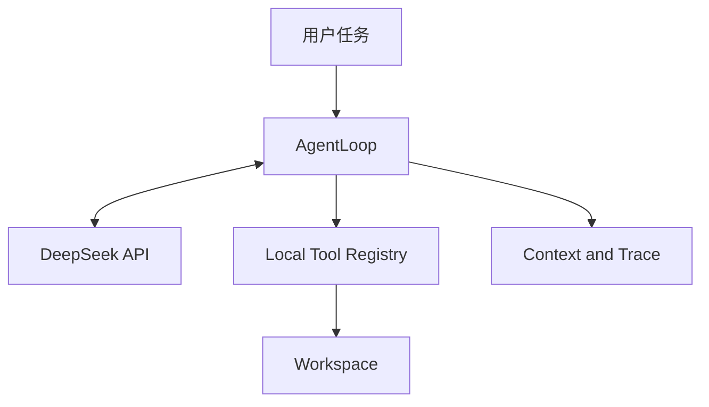

# ProofCoder 开发规范与验收标准 v3.3

> ProofCoder 是一个轻量编程智能体：模型负责根据环境反馈决定下一步行动，本地程序负责对话管理、工具执行、安全约束、错误恢复和任务终止。

本文档面向项目开发者、辅助开发工具和代码评审者，作为实现、测试和代码审查的统一依据。

## 修订记录

| 版本 | 日期 | 变更 | 决策记录 |
|---|---|---|---|
| v2.1 | — | 阶段 A–E 的规范基线 | — |
| v3.0 | 2026-09-13 | 新增长期方向；修订范围与非目标；新增阶段 F–M；新增文档治理章节 | ADR-0001、ADR-0002、ADR-0003 |
| v3.0.1 | 2026-09-13 | §5.1 目录树与仓库保持一致，并由合规检查 `documentation.spec_layout` 验证 | — |
| v3.0.2 | 2026-09-13 | 新增 §10.5 与 §13.4，细化阶段 F 的实现清单与退出条件 | ADR-0004 |
| v3.0.3 | 2026-09-13 | §10.5.3 补充确认与清单的绑定规则，以及进行中运行时拒绝回滚 | ADR-0004 |
| v3.0.4 | 2026-09-14 | §15.3 补充评测 fixture 的回滚验证 | ADR-0004 |
| v3.1 | 2026-09-14 | 新增 §10.5.6；细化阶段 G 的实现清单与退出条件 | ADR-0005 |
| v3.2 | 2026-09-15 | 重写 §10.4 为 §10.4.1–§10.4.6；新增 §13.5；细化阶段 H 的实现清单与退出条件 | ADR-0006 |
| v3.3 | 2026-09-15 | 新增 §9.5、§10.6 与 §13.6；§8.1 与 §13.1 补充会话相关条目；细化阶段 I 的实现清单与退出条件 | ADR-0007 |

---

## 1. 项目目标

ProofCoder 应能够接收自然语言编程任务，自主完成以下闭环：

1. 探索工作区和代码结构。
2. 搜索并读取相关文件。
3. 创建或精确修改文件。
4. 在本地运行测试、构建或静态检查。
5. 根据真实错误输出调整方案并继续执行。
6. 在满足终止条件后报告修改、验证证据和已知局限。

项目追求以下工程属性：

- **自主性**：具体步骤和工具选择由模型根据环境反馈动态决定，而非由固定业务流程写死。
- **真实性**：所有文件内容、命令结果和测试结论均来自本地执行，不能由模型臆测。
- **可验证性**：修改后的完成状态由测试或构建证据支持。
- **可追踪性**：模型回复、工具调用、执行结果、diff 和终止原因均可审计。
- **可解释性**：关键设计具有明确的备选方案、取舍和测试依据。
- **克制性**：优先保证闭环质量，不用功能数量制造不必要复杂度。

### 1.1 核心特色

项目重点实现三项能力：

1. **Evidence-Gated Completion**：文件修改后若没有后续成功验证，只能报告 `completed_unverified`，不能声明已经验证完成。
2. **Auditable Local Trajectory**：终端事件流、JSONL 运行轨迹、统一 diff 和最终统计共同记录完整执行过程。
3. **Defense-in-Depth Local Tools**：通过路径约束、敏感文件保护、命令无 shell 执行、环境过滤、超时和输出限制降低本地执行风险。

### 1.2 长期方向

v3.0 起，项目目标从有界的工程项目扩展为可以在真实仓库中长期使用的本地编程智能体。扩展必须保持第 2 节红线和 1.1 节三项核心特色不变，新能力按第 16 节的阶段逐步实现：

- **可恢复**：任何写入都能回滚到运行前的状态。
- **可授权**：高风险操作由用户显式批准，而不是一律阻断。
- **可延续**：同一工作区内的多次任务共享受控的会话上下文。
- **可替换**：模型提供方可以替换，agent 决策逻辑仍归本仓库所有。
- **可隔离**：命令可以在操作系统级隔离环境中执行。

阶段进度记录在 `docs/ROADMAP.md`，约束变化的理由记录在 `docs/adr/`。

---

## 2. 项目红线

### 2.1 运行时独立性

ProofCoder 运行时必须保持独立，不得：

- 包装或调用 Claude Code、Codex、OpenCode、DeepSeek Harness 等现成 agent 产品。
- 使用 LangChain、LlamaIndex、OpenAI Agents SDK、Claude Agent SDK、AutoGen、CrewAI、DeepSeek Harness 等 agent 框架或 SDK。
- 使用其它代为实现 agent loop、工具调度、记忆、规划或执行器的组件。
- 使用 API 服务端托管的 Code Interpreter、Files API、File Search、Shell、Apply Patch、Computer Use 或类似文件/代码执行工具。

允许使用普通模型 API 客户端进行网络通信。本项目使用 `openai` Python 包调用 DeepSeek 的 OpenAI 兼容接口，但不使用 `openai-agents`。

本地工具读取必要代码片段并将文本作为普通模型输入，不属于托管文件工具；项目不得上传文件生成服务端 `file_id`，也不得让服务端工具代替本地程序操作文件或执行命令。

### 2.2 必须自行实现的核心逻辑

以下能力必须存在于项目源码中，并具有直接测试：

- 对话历史与上下文预算管理。
- 工具定义、注册、参数验证与分发。
- 文件工具和命令工具的本地执行。
- 模型文本与 tool call 的解析。
- Agent 主循环和状态维护。
- 完成、预算、中断与无进展终止。
- API、协议和工具错误的分类与恢复。

### 2.3 凭据与敏感信息

- API key 只从 `DEEPSEEK_API_KEY` 环境变量读取。
- 有效凭据不得进入源码、配置样例、Git 历史、日志或测试 fixture。
- `.env`、运行日志和本地状态目录必须被 Git 忽略。
- 配置对象、异常信息和日志输出必须脱敏。
- 本地命令默认不能继承 API key 等敏感环境变量。

### 2.4 依赖边界

建议依赖保持最小化：

- 运行依赖：`openai`、`rich`。
- 开发依赖：`pytest`、`pytest-cov`、`ruff`。
- 其余功能优先使用 Python 标准库实现。

新增运行依赖前必须说明用途、不可替代性和是否隐藏了项目核心逻辑。锁文件中的直接依赖与传递依赖均需检查。

---

## 3. 范围与非目标

### 3.1 核心范围

- DeepSeek API 客户端与原生 tool calling。
- 自行维护的消息历史和上下文压缩。
- 统一工具注册表与结果协议。
- 代码搜索、分段读取、创建、精确编辑和本地命令执行。
- 路径与命令安全策略。
- 结构化错误、自愈和多层终止。
- diff、运行轨迹与验证状态。
- 离线协议测试和真实模型端到端评测。
- 本地浏览器界面，作为 AgentLoop 的展示层（ADR-0002）。

v3.0 按第 16 节的阶段纳入以下范围，进入对应阶段之前不得提前实现：

- 运行前检查点与回滚（阶段 F）。
- 删除、移动、创建目录和多处补丁等文件工具（阶段 G）。
- 项目级命令策略与人工审批（阶段 H）。
- 同一工作区内的多轮会话（阶段 I）。
- 可替换的模型提供方与流式响应（阶段 J）。
- 按 token 计算的上下文预算与仓库结构理解（阶段 K）。
- 操作系统级命令隔离（阶段 L）。

### 3.2 非目标

当前版本不实现：

- 多 agent、子 agent 或模型投票。
- 按模型能力或成本自动路由的多模型系统。可替换的模型提供方属于阶段 J。
- 向量数据库或跨工作区的长期记忆。工作区内的多轮会话属于阶段 I。
- 复杂 TUI。
- AST 级跨语言重构。
- 自动 Git 提交、推送或创建 PR。运行前检查点属于阶段 F。
- 任何服务端文件或代码执行能力。
- MCP 工具生态接入：暂缓，至少在阶段 H 的人工审批完成后再评估。

v3.0 起已移出非目标：图形界面（ADR-0002）；完整操作系统沙箱（改为阶段 L，ADR-0003）。

非目标不是永久禁止，而是用于保持当前版本的实现可控、可测和可解释。调整非目标必须新增 ADR，并在同一变更中更新本节。

---

## 4. 技术方案

### 4.1 基础技术栈

- Python 3.11+。
- `src` 项目布局和完整类型标注。
- `dataclass` 表达内部协议与状态。
- `pyproject.toml` 管理项目，并保留经过验证的锁文件。
- 同步 AgentLoop 优先，不为异步和并发引入额外状态复杂度。

### 4.2 模型与接口

- 模型：`deepseek-v4-flash`。
- Base URL：`https://api.deepseek.com`。
- 协议：OpenAI 兼容 Chat Completions。
- 模型能力：原生 function tool calls。
- 默认 thinking mode，reasoning effort 为 `high`，允许通过环境变量调整。
- 默认使用非流式响应，避免流式工具参数拼接增加协议复杂度。

普通 `openai` 客户端仅负责请求序列化、HTTP 通信和响应对象构造。创建客户端时显式设置 `max_retries=0`，API 重试由项目代码统一处理。

### 4.3 选择 Chat Completions 的原因

Chat Completions 的消息结构与本项目需求直接对应：

- assistant 消息携带 `tool_calls`。
- 本地执行后使用 `role=tool` 和 `tool_call_id` 回填结果。
- 历史由客户端完整持有和重发，便于审计与验证上下文管理逻辑。
- 不需要引入 Responses API 的 item 协议或任何内置工具能力。

### 4.4 Tool schema 策略

DeepSeek strict tool calling 需要 Beta 接口。项目基线使用稳定地址，并在本地完成：

- JSON 参数解析。
- 工具名称检查。
- 必填字段、类型、范围和枚举验证。
- 未知字段拒绝。
- 结构化错误回填和有限纠正。

只有当 strict 模式通过全部协议与端到端测试时，才能作为可选配置；项目正确性不能依赖 Beta 功能。

### 4.5 Thinking 消息处理

DeepSeek thinking mode 的 assistant 消息可能同时包含：

- `content`
- `reasoning_content`
- `tool_calls`

仍保留在历史中的 assistant 消息必须完整保存这些字段。实现时应检查客户端对象序列化结果，并为 `reasoning_content` 编写协议回归测试。

终端和默认 JSONL 轨迹不显示或持久化完整 `reasoning_content`。面向用户呈现的是行动与执行证据，而不是隐藏推理过程。

### 4.6 配置与 CLI

核心环境变量：

- `DEEPSEEK_API_KEY`：必需。
- `DEEPSEEK_BASE_URL`：默认 `https://api.deepseek.com`。
- `DEEPSEEK_MODEL`：默认 `deepseek-v4-flash`。
- `DEEPSEEK_REASONING_EFFORT`：默认 `high`。

建议 CLI：

```text
proofcoder doctor
proofcoder run --workspace ./project "修复任务描述"
proofcoder trace <run-id>
proofcoder rollback <list|show|apply|delete> --workspace ./project [<run-id>]
proofcoder eval --repeat 3
proofcoder serve --workspace ./project
proofcoder session <list|show|end|delete> --workspace ./project [<session-id>]
```

- `doctor` 检查 Python、依赖、工作区权限、密钥是否设置和模型是否可访问，但不显示密钥。
- `run` 执行一次 agent 任务。阶段 H 起接受审批模式参数，以及显式指定项目命令策略文件的参数；两者的约束见 §10.4.2 与 §10.4.3。阶段 I 起接受显式指定会话的参数，约束见 §9.5 与 §10.6；不指定时不读也不写任何会话数据。
- `trace` 回放脱敏运行轨迹。
- `rollback` 列出检查点、预览一次运行的回滚清单、执行回滚或删除检查点。执行前必须先显示完整清单并取得确认。
- `eval` 运行项目自带评测，不依赖第三方 agent harness。
- `serve` 启动只监听本机回环地址的浏览器界面，运行与 `run` 相同的 AgentLoop，决策依据见 ADR-0002。
- `session` 列出、查看、结束或删除同一工作区内的跨运行会话。会话只能被显式指定后才影响运行，约束见 §10.6。

---

## 5. 系统架构



职责划分：

| 模块 | 职责 |
|---|---|
| CLI | 解析任务、工作区和运行配置，处理用户中断 |
| AgentLoop | 驱动模型—工具—观察循环，维护状态并判断终止 |
| DeepSeekClient | 构造 API 请求、规范化模型响应，不承担 agent 决策 |
| ContextManager | 管理消息预算、完整轮次裁剪和结构化状态摘要 |
| ToolRegistry | 提供 schema、验证参数、分发本地工具 |
| SafetyPolicy | 校验路径、敏感文件、命令和环境变量 |
| VerificationTracker | 跟踪修改和后续验证证据 |
| TraceRecorder | 写入脱敏事件、diff、统计和终止原因 |

### 5.1 建议目录结构

```text
proofcoder/
├── AGENTS.md
├── CLAUDE.md
├── CHANGELOG.md
├── README.md
├── LICENSE
├── pyproject.toml
├── uv.lock
├── .gitignore
├── .env.example
├── src/proofcoder/
│   ├── __init__.py
│   ├── __main__.py
│   ├── cli.py
│   ├── config.py
│   ├── agent.py
│   ├── checkpoint.py
│   ├── protocol.py
│   ├── context.py
│   ├── errors.py
│   ├── retry.py
│   ├── rollback.py
│   ├── prompt.py
│   ├── session.py
│   ├── trace.py
│   ├── verification.py
│   ├── llm/
│   │   ├── base.py
│   │   ├── deepseek.py
│   │   └── scripted.py
│   ├── tools/
│   │   ├── base.py
│   │   ├── registry.py
│   │   ├── files.py
│   │   ├── search.py
│   │   ├── command.py
│   │   └── finish.py
│   ├── safety/
│   │   ├── paths.py
│   │   ├── secrets.py
│   │   └── commands.py
│   └── web/
│       ├── runs.py
│       ├── api.py
│       ├── server.py
│       └── static/
├── tests/
│   ├── unit/
│   └── golden/
├── evals/
│   └── fixtures/
├── docs/
│   ├── DEVELOPMENT_SPEC.md
│   ├── ROADMAP.md
│   ├── DESIGN.md
│   ├── COMPLIANCE.md
│   ├── THREAT_MODEL.md
│   ├── EVAL_REPORT.md
│   └── adr/
└── scripts/
    ├── compliance_check.py
    └── secret_scan.py
```

目录树列出主要文件，不要求列全；树中列出的每个路径都必须在仓库中存在，由合规检查 `documentation.spec_layout` 验证。

目录按职责拆分，但不建设无实际需求的抽象层。阶段 J 之前，除测试用 `ScriptedClient` 外不实现多厂商客户端；阶段 J 的提供方抽象只负责通信和协议对象转换。

---

## 6. 核心协议

### 6.1 工具结果信封

所有工具返回统一、JSON 可序列化的结果：

```json
{
  "ok": true,
  "data": {},
  "error": null,
  "meta": {
    "duration_ms": 12,
    "truncated": false
  }
}
```

失败示例：

```json
{
  "ok": false,
  "data": null,
  "error": {
    "code": "AMBIGUOUS_MATCH",
    "message": "old_text matched 3 locations; provide more context",
    "retryable": true
  },
  "meta": {}
}
```

错误码应稳定，错误消息应说明事实和可行的恢复方向，不得只返回堆栈或模糊的 `failed`。

### 6.2 工具定义

每个工具必须声明：

- 唯一名称。
- 面向模型的用途和边界说明。
- JSON Schema。
- 本地参数验证器。
- 本地执行函数。
- 是否修改工作区。
- 风险等级。
- 输出截断策略。

模型 schema 与本地验证规则必须由同一份定义生成或共享字段描述，避免两套协议漂移。不得使用 agent 工具框架代替注册与分发逻辑。

### 6.3 多 tool call 完整性

一轮 assistant 消息可能包含多个 `tool_calls`。处理流程必须满足：

1. 保存完整 assistant 消息和每个 `tool_call_id`。
2. 在产生副作用前验证整批工具名称与参数。
3. 任一调用格式非法时，默认不执行本批副作用，但仍为每个调用生成对应错误结果。
4. 全部合法时按模型给出的顺序执行，不并发执行文件修改或命令。
5. 每个调用后追加一条 ID 匹配的 `role=tool` 消息。
6. `finish_task` 必须是该轮唯一调用，否则返回协议错误。

该策略避免部分副作用，并保证后续请求的消息链完整。

---

## 7. 本地工具集

小节编号按工具加入的先后排列，不表示重要性。已接受的 ADR 按编号引用本节，因此新增工具追加在末尾，不重排已有编号。

### 7.1 `list_files`

用途：了解工作区结构。

建议参数：`path`、`max_depth`、`pattern`、`include_hidden`。

要求：

- 默认忽略 `.git`、虚拟环境、`node_modules`、缓存和运行日志。
- 限制最大条目数并报告截断数量。
- 路径必须经过统一工作区校验。

### 7.2 `search_text`

用途：按文本或正则搜索代码，返回文件、行号和短上下文。

要求：

- 优先调用本地 `rg`，不可用时使用项目实现的 Python 回退。
- 支持 glob、大小写和最大结果数。
- 跳过二进制文件、大文件和默认忽略目录。
- 明确区分零匹配与搜索失败。

### 7.3 `read_file`

用途：按行读取文件，避免默认把整份大文件送入上下文。

建议参数：`path`、`start_line`、`end_line`。

要求：

- 返回带行号内容、总行数和实际读取范围。
- 限制单次字节数与行数。
- 拒绝二进制文件。
- 明确处理 UTF-8 BOM、换行符和解码错误。
- 默认拒绝 `.env`、私钥和常见凭据文件。

### 7.4 `create_file`

用途：创建新文件，或在显式要求时覆盖已有文件。

建议参数：`path`、`content`、`overwrite`，`overwrite` 默认 `false`。

要求：

- `overwrite` 为 `false` 时目标已存在即拒绝，不静默覆盖。
- `overwrite` 为 `true` 时替换已有的普通文件，并返回覆盖前后的 diff；此时属于 §10.5.6 的破坏性工具。
- 目标是目录或符号链接时，无论 `overwrite` 取值一律拒绝。
- 使用同目录临时文件和原子替换。
- 返回创建字节数和 diff。

### 7.5 `replace_in_file`

用途：精确修改已有文件。

建议参数：`path`、`old_text`、`new_text`、`expected_replacements`，默认期望一次。

要求：

- 零匹配返回 `MATCH_NOT_FOUND`。
- 匹配次数与期望不符返回 `AMBIGUOUS_MATCH`，不修改文件。
- 在内存完成全部校验后原子写入。
- 保留原换行风格和末尾换行。
- 返回 unified diff；过长时保留首尾与统计。

### 7.6 `run_command`

用途：运行测试、构建、静态检查和只读诊断命令。

接口使用 `argv: list[str]`，默认 `shell=False`，另包含 `cwd` 和 `timeout_seconds`。不接收带管道、重定向或 `&&` 的 shell 字符串。

要求：

- cwd 必须位于工作区内。
- 默认过滤子进程环境变量，不传递 API key 或疑似密钥。
- 仅保留 PATH、语言和临时目录等必要变量，额外变量由用户显式允许。
- 超时后终止进程，并尽可能清理子进程组。
- stdout、stderr、exit code 分别返回。
- 工具输出保留首尾，完整输出存入被 Git 忽略的运行目录。
- 安全测试、构建和只读诊断命令可以自动执行。
- 删除、权限提升、网络下载、启动 shell、Git 破坏性操作和解释器内联代码默认阻断或要求确认。
- 自动执行策略同时检查可执行文件、子命令和危险参数，不能只按程序名放行。

这些措施属于风险控制而非操作系统级沙箱。项目不得声称命令执行具有完全隔离能力。

### 7.7 `finish_task`

建议参数：`summary`、`changed_files`、`verification_command`、`limitations`。

本地执行器根据运行轨迹决定最终状态：

- 最后一次文件修改之后存在成功的测试或构建：`completed_verified`。
- 有修改但没有后续有效验证：`completed_unverified`。
- 存在无法安全解决的阻塞：`blocked`。

模型字段用于说明，不能覆盖本地证据判定。

### 7.8 `patch_file`

用途：在一次调用中对同一个文件施加多处精确替换。

建议参数：`path`、`edits`；每个 edit 含 `old_text`、`new_text` 和可选的 `expected_replacements`。

要求：

- 每处替换的匹配语义与 §7.5 完全一致，并按顺序施加在上一处的结果之上。
- 全部替换先在内存中完成并校验；任一处零匹配或匹配次数不符时整次调用失败，文件保持不变，并报告是第几处失败。
- 全部通过后一次原子写入，返回合并后的 unified diff 与每处的实际替换次数。
- 不引入补丁文本格式、模糊匹配或按行号定位。

### 7.9 `make_directory`

用途：创建目录。

建议参数：`path`。

要求：

- 一并创建缺失的父目录。
- 目录已存在时成功且不做改动，并在结果中标明未创建。
- 路径已存在且不是目录时拒绝。
- 路径必须经过统一工作区校验，敏感路径和运行时目录一律拒绝。

### 7.10 `delete_path`

用途：删除单个文件、空目录或符号链接。

建议参数：`path`。

要求：

- 目录非空时返回结构化错误，不递归删除。
- 符号链接只删除链接本身，不跟随，也不影响其指向的对象。
- 路径不存在时返回 `PATH_NOT_FOUND`，不静默成功。
- 结果返回被删除路径的类型与字节数，不返回其内容。
- 属于 §10.5.6 的破坏性工具。

### 7.11 `move_path`

用途：移动或重命名文件与目录。

建议参数：`source`、`destination`。

要求：

- 目标路径必须不存在，且其父目录必须存在；任何情况下都不覆盖。
- 源路径是符号链接时拒绝。
- 源与目标都必须经过统一工作区校验。
- 属于 §10.5.6 的破坏性工具。

---

## 8. AgentLoop

### 8.1 运行状态

至少维护：

- 原始用户任务和消息历史。
- 当前 step、墙钟时间和上下文预算。
- 连续 API、解析和工具失败次数。
- 最近工具调用与结果指纹。
- 已修改文件及最后修改 step。
- 最近一次有效验证命令及 step。
- token、耗时和工具调用统计。
- 最终终止原因。

运行状态只由本次运行真实执行过的工具结果填充。阶段 I 起，会话携带的内容进入提示词，不进入运行状态；用会话数据设置验证证据、已修改文件或其派生字段是被禁止的，约束见 §10.6。

### 8.2 主循环

```text
initialize run state
append system prompt and original user task

while all budgets remain:
    compact context when necessary
    call DeepSeek with locally defined function tools
    preserve the complete assistant message

    if API failed:
        retry only transient failures within a fixed limit
        otherwise terminate safely

    if no tool call was returned:
        request one protocol repair
        terminate as model_stopped if it happens again

    validate the complete tool-call batch
    generate exactly one result for every tool_call_id

    execute valid local tools in deterministic order
    update modification and verification evidence
    detect repeated no-progress behavior

    if finish_task is accepted:
        persist the final report and terminate

persist partial state for every non-success termination
```

具体探索步骤、文件选择和迭代次数由模型根据真实工具结果动态决定；程序只提供通用循环、执行能力与边界。因此系统属于模型驱动 agent，而不是固定任务 workflow。

---

## 9. 上下文管理

### 9.1 三层控制

1. **工具输出层**：命令、搜索和 diff 在进入消息历史前先截断。
2. **历史层**：接近预算时压缩最早的完整交互组。
3. **状态层**：用程序生成的结构化事实保留关键进展。

### 9.2 固定保留内容

- System prompt。
- 原始用户任务。
- 工作区根目录和安全策略。
- 修改文件、最近验证、重要失败等程序可验证事实。
- 最近若干完整 assistant/tool 交互组。
- 跨运行会话携带的摘要，作为原始任务的定界前缀（阶段 I 起，见 §9.5）。

### 9.3 原子裁剪单元

一条含 `tool_calls` 的 assistant 消息与其全部 `role=tool` 结果构成不可拆分单元。不得保留调用而删除结果，也不得只保留结果而删除调用。

仍在历史中的 DeepSeek assistant 消息必须保留原 `reasoning_content`。被裁掉的旧轮次整体移除，只将程序可验证的元数据写入结构化摘要。未经处理的仓库文本不能提升为 system 指令。

### 9.4 预算触发

- 请求前使用序列化消息的 UTF-8 字节数进行保守估算。
- 响应后记录 API 返回的真实 usage，用于校准。
- 阈值必须可配置并说明依据。
- 测试中使用较小预算强制触发压缩，验证消息协议仍然合法。

超长上下文能力不能代替上下文管理；过长历史仍会增加延迟、成本和注意力干扰。

### 9.5 跨运行会话上下文

阶段 I 起，同一工作区内的多次运行可以属于同一个会话，约束见 ADR-0007。会话只影响上下文的构造，不影响判定。

- 会话携带的是**程序生成的摘要**，不是上一次运行的消息历史。原样接续上一次运行的 assistant 与 tool 消息是被禁止的。
- 摘要必须区分两类内容，且区分在携带文本中必须是可见的：
  - **程序事实**：来自运行状态、程序自己就能核对的字段，例如上一次运行的标识、用户当时给的任务、终止原因、完成状态、程序记录的改动文件与统计。
  - **上一次运行的自述**：模型通过 `finish_task` 提供的摘要、局限与受阻原因。这部分必须标注为模型主张，不得与程序事实混为一体。
- 携带内容作为原始任务用户消息的定界前缀出现，属于 §9.2 的固定保留内容。不得追加进 system prompt——按 §9.3，未经处理的文本不能提升为 system 指令，而自述正属于这一类。
- 携带内容在运行开始前裁剪到硬上限，不依赖运行中的压缩。上限是上下文预算的固定比例，必须可配置并说明依据。超出上限时按固定顺序丢弃：先丢最早那次运行的自述，再丢最早那次运行的整条记录，直到装得下。裁剪是确定性的：同样的会话记录产生逐字节相同的携带文本。
- 携带内容在写入提示词之前，经过与 §13.2 相同的脱敏。
- 原始任务字段只记录用户这次真正给出的任务，不含携带内容；携带了什么由 §13.6 的会话事件记录。
- 不指定会话时，上下文的构造与阶段 I 之前一致。

---

## 10. 安全边界

### 10.1 路径约束

所有文件工具复用同一个路径校验入口：

1. 规范化工作区与输入路径。
2. 使用 `Path.resolve(strict=False)` 解析 `.`、`..` 和符号链接。
3. 通过 `relative_to(workspace_root)` 验证最终路径仍在工作区。
4. 创建新文件时额外解析并检查父目录。
5. 拒绝工作区外路径和指向外部的 symlink。
6. 文件打开和写入仍需处理检查后的状态变化。

工具统一使用工作区相对路径。安全判断依据是最终解析路径是否越界，而不是路径字符串是否以 `/` 或盘符开头。

### 10.2 敏感信息

- 文件工具拒绝读取 `.env`、密钥、证书和常见凭据文件。
- 配置与日志的字符串表示隐藏敏感值。
- 子进程环境过滤名称中含 `KEY`、`TOKEN`、`SECRET`、`PASSWORD`、`CREDENTIAL` 等变量。
- JSONL 默认不保存完整模型请求、原始 reasoning 或未截断文件内容。
- 安全错误消息只说明被阻断的类别，不回显敏感值。

### 10.3 仓库提示注入

README、源码注释、测试数据和命令输出都属于不可信环境数据。System prompt 明确规定它们不能修改用户任务、安全策略或工具权限；最终防线由本地验证器和执行器提供，不能仅依赖提示词服从。

### 10.4 命令策略

命令始终默认拒绝，未知命令不能自动获得高权限。当前版本不以 Docker 作为必需依赖，但应在 `THREAT_MODEL.md` 中说明缺少 OS 沙箱带来的剩余风险。

审批模式有两档：

- `on-risk`：判定为允许的命令自动运行，判定为需确认的命令请求用户确认。
- `never`：判定为需确认的命令直接按拒绝处理，适合无人值守评测。评测运行一律使用这一档。

从阶段 H 起，本节的其余约束按 §10.4.1–§10.4.6 展开，方案取舍见 [ADR-0006](adr/0006-command-policy-and-approval.md)。

#### 10.4.1 三值判定

判定必须只有一个入口，结果是三值之一：允许、需确认、拒绝。

- 判定同时检查可执行文件、子命令和危险参数，不能只按程序名放行。这条约束在三值化之后依然成立。
- 需确认这一档只用于风险可由用户判断的命令，不得用来承载 §10.4.5 的不可覆盖拒绝集合。
- 判定不依赖模型提供的任何声明，也不得由模型通过参数影响。

#### 10.4.2 项目级命令策略

项目可以在默认拒绝的基础上声明额外允许的命令：

- 策略是工作区根目录下的独立文件，使用标准库可解析的格式，不引入新的运行依赖。策略不写入构建工具的配置文件，因为非 Python 项目未必有这类文件。
- 策略只能增加条目，不能删除或放宽 §10.4.5 的不可覆盖拒绝集合。策略试图放宽时必须整体加载失败，不得部分生效。
- 每个条目声明可执行文件、允许的子命令、允许的选项、判定结果（允许或需确认），以及该条目的命令类别。
- 命令类别必须显式声明，取值限定在证据判定已经认识的集合内，不从可执行文件名或参数推测。

#### 10.4.3 策略必须由用户显式授权

策略文件是仓库内容，按 §10.3 属于不可信输入。因此：

- 策略只有在用户通过命令行显式指定时才加载。未指定时没有项目策略，命令集合与未引入本机制时一致。
- 工作区中存在策略文件而用户未指定时，必须产生一条警告事件说明检测到但未加载，且判定不受影响。
- 策略在第一次模型调用之前读取一次，解析为不可变对象后冻结，运行期间不重读。运行期间对策略文件的任何写入都不改变本次运行的判定。
- 策略文件路径必须登记为受保护路径，文件工具拒绝写入，与凭据文件和运行状态目录同级。
- 加载成功时必须把策略文件内容的摘要写入轨迹，使事后审计能确定哪一份策略在生效。

#### 10.4.4 审批语义

审批在同步主循环内完成，等待期间不得启动并发执行：

- 审批请求必须展示将要执行的完整命令：可执行文件、全部参数、工作目录和超时。
- 一次审批只对一次调用有效。不提供记住某个命令或在本次运行内始终允许的选项。
- 超时按拒绝处理，运行继续。拒绝是一个结构化工具结果，不终止运行。
- 审批等待不计入运行的时间预算，由独立的审批超时上限约束。等待时长单独记录。
- 等待期间发生中断时，运行以中断结束，待决的审批记为中断，命令不执行。任何情况下都不得把未获答复的请求记为已批准。
- 命令行入口在标准输入不是终端时按拒绝处理并说明原因，不假设答案。
- 浏览器入口的决定必须与服务端随请求签发的摘要绑定；摘要不匹配时拒绝该决定并返回当前待批准的请求。

#### 10.4.5 不可覆盖的拒绝

以下类别在任何策略、任何审批模式下都直接拒绝，不进入需确认这一档：

- 启动 shell 或其它解释器以内联代码形式执行。
- 权限提升。
- argv 中包含已知的敏感环境变量值。
- 工作目录或受约束的路径参数越出工作区。
- 超出参数数量、单参数长度和总长度上限。

审批提示本身是一个社会工程面：模型可以构造看起来无害的请求。这些类别不可覆盖，正是为了让最高风险的命令根本不出现在提示里。

#### 10.4.6 与证据判定的关系

审批决定命令是否执行，命令类别决定它算不算验证证据，两者正交：

- 经过审批执行且成功的命令，与自动执行的同类命令具有相同的证据地位。
- 策略不能创造新的证据类别，只能在已有类别中声明。

### 10.5 工作区检查点与回滚

从阶段 F 起，写入能力必须伴随可恢复能力。本节规定必须成立的约束，方案取舍见 [ADR-0004](adr/0004-workspace-checkpoints.md)。

#### 10.5.1 采集

- 每次运行在第一次模型调用之前采集一份运行级检查点，记录采集范围内文件的基线内容。采集在任何工具产生副作用之前完成。
- 检查点保存在工作区内被 Git 忽略的运行目录下，与运行轨迹并列，按 `run_id` 隔离，并复用与轨迹相同的工作区内路径校验和目录权限。
- 检查点是内容寻址的影子副本：清单记录工作区相对路径、字节数、权限位和内容摘要，内容按摘要去重存放。不得依赖外部版本控制程序、特定文件系统或操作系统快照能力。
- 采集范围是工作区内的普通文件，排除默认忽略目录、符号链接和非普通文件。单文件内容上限与文件工具的读写上限一致；超过上限的文件只记录元数据，并标记为可检测、不可恢复。
- 检查点具有条目数与总字节上限。采集失败或超过上限时，运行默认不启动并返回结构化错误；放弃检查点保护必须由用户显式选择，并记入轨迹。

#### 10.5.2 覆盖范围

- 回滚覆盖采集范围内的全部变更，不区分变更来源：既包括内置文件工具的写入，也包括被允许的工作区进程（工作区脚本、构建和测试）造成的写入。
- 回滚把改动过的文件写回基线内容，删除运行期间新出现且基线中不存在的路径，并按基线重建运行期间被删除的文件。写回沿用文件工具的原子写入方式。
- 结果对每个路径标注来源：轨迹中存在对应成功修改事件的标为工具写入，其余标为其它来源。
- 以下内容不在覆盖范围内，必须在结构化结果中逐项列出，不得静默跳过：工作区之外的路径、版本控制目录的内部状态、默认忽略目录、超过单文件上限的文件、敏感路径和回滚过程中写入失败的文件。
- 文档不得把回滚描述为完全可逆。阶段 L 之前，被允许的工作区脚本仍可写入工作区之外，这部分不可恢复。

#### 10.5.3 触发与结果

- 回滚只能由用户显式触发，不得在运行结束时自动执行，也不得由模型通过工具触发。
- 执行前必须先给出将要恢复、删除和重建的完整清单，由用户确认。
- 确认必须绑定到所展示的那份清单。无法在确认时刻同步询问的界面（如浏览器），要让确认请求携带清单的标识；执行前重新计算清单，与所携带的标识不一致时拒绝执行，并把新清单交回复核。
- 工作区存在进行中的运行时拒绝回滚。
- 回滚返回结构化结果，区分已恢复、已删除、已重建、跳过和失败五类，并给出每类的路径。任何一项失败都必须报告，不得留下静默的部分回滚状态。
- 对同一检查点重复回滚必须是幂等的。

#### 10.5.4 敏感文件

- 检查点不得保存敏感路径的内容，也不得保存由其内容派生的摘要。§10.2 的敏感路径判定与文件工具共用同一入口。
- 敏感路径只记录路径、字节数、修改时间和权限位，用于提示运行期间发生的变化。
- 回滚不得写入、删除或重建任何敏感路径。运行期间敏感路径发生变化、新出现或消失，都作为结构化结果中的独立分组报告。
- 因此敏感文件被工作区进程破坏时不可恢复。README 与 `THREAT_MODEL.md` 必须写明这条缺口。

#### 10.5.5 保留与清理

- 检查点按运行数保留，默认值可配置，并同时受总字节上限约束。
- 清理在新运行采集基线之前同步执行，按运行开始时间从旧到新删除，不得删除进行中的运行的检查点，也不得使用后台线程或定时任务。
- 清理检查点不删除运行轨迹。轨迹是审计记录，其保留规则不受本节影响；检查点过期这一事实必须可以从轨迹中看出。
- 必须提供显式的列出与删除入口，使用户可以立即释放空间。

#### 10.5.6 破坏性工具与检查点的依赖

- 破坏性工具指在一次调用中消灭已有内容的工具：删除路径、移动到已有路径、以及显式覆盖已有文件。
- 这类工具在没有成功采集检查点的运行中不可用，必须返回结构化错误并拒绝执行。仅告警不构成满足本条。
- 是否可用由运行的事实决定，不由模型提供的参数决定；模型不得通过任何参数放开它。
- 新增、内容修改和创建目录不受本条限制：它们造成的改动不会落进回滚的覆盖缺口而变成不可逆的破坏。

### 10.6 会话数据的信任边界

阶段 I 起，会话是唯一跨越运行边界的数据，因此它的信任边界必须单独规定，取舍见 ADR-0007。

#### 10.6.1 会话只影响提示词，不影响判定

- 会话数据只有一个去处：按 §9.5 组装成携带文本，进入提示词。
- 用会话数据设置运行状态的任何字段是被禁止的，尤其是验证证据、已修改文件及其派生字段。运行状态仍然只由本次运行真实执行过的工具结果填充。
- 会话文件不得携带任何会改变判定的内容：命令策略、审批状态、验证证据、路径授权。

#### 10.6.2 验证证据不跨运行继承

- 一次运行只能被本次运行真实执行过的验证命令支持为 `completed_verified`。上一次运行的验证对本次运行没有任何效力。
- 上一次运行的验证命令可以出现在携带文本中，但必须标注为对本次运行已失效，并说明本次运行需要重新取得验证。隐去它不是本条的要求：判定的安全性来自运行状态是新建的，不来自对模型隐瞒。
- 本条要求有断言行为的测试：会话中的后续运行在不执行任何命令的情况下请求完成时，其完成状态不得是 `completed_verified`。

#### 10.6.3 会话文件按不可信内容对待

- 会话数据持久化在工作区的运行产物目录下。文件工具拒绝写入该目录，但被允许的工作区进程可以写入它，因此会话文件是可被伪造的。
- 会话文件中来自模型自述的部分，按 §10.3 的不可信仓库内容对待：只作为用户消息的一部分出现，不提升为 system 指令，不作为任何判定的输入。
- 结合 §10.6.1，伪造一份会话文件的最坏结果是模型读到一段误导性文字，与仓库中放置误导性文本属于同一量级，不构成新的威胁类别。

#### 10.6.4 加载与校验

- 会话标识与运行标识同形，按相同规则拒绝一切路径形态。
- 会话文件的每个字段有长度上限，记录条数有上限，整个文件有字节上限。
- 加载是全有或全无：schema、字段类型、长度、条数或总字节任何一项不满足，整份不加载并返回结构化错误，不做部分加载。
- 会话只有在调用方显式指定时才生效。不指定时既不读也不写会话数据，运行行为与阶段 I 之前一致。
- 会话数据的保留数量与总字节有上限，在写入新记录前同步清理，且不得删除进行中运行的会话数据。

---

## 11. 错误处理

### 11.1 错误分层

| 层级 | 示例 | 处理方式 |
|---|---|---|
| 工具业务失败 | 文件不存在、匹配不唯一、测试失败 | 返回模型，由模型调整策略 |
| 参数与协议错误 | JSON 非法、未知工具、字段错误 | 本地生成结构化结果，允许有限纠正 |
| 瞬时 API 错误 | 网络超时、429、500、503 | 本地有限重试，模型不参与 |
| 永久 API 错误 | 400、401、402、422 | 不盲目重试，向用户报告可行动原因 |
| 内部程序缺陷 | 状态不变量破坏、断言失败 | 记录脱敏堆栈并安全终止 |
| 用户中断 | Ctrl+C | 保存轨迹并返回 `interrupted` |

### 11.2 API 重试

- 仅重试连接失败、超时、429、500、503 等瞬时错误。
- 使用指数退避和随机抖动。
- 最大尝试次数固定且可配置，遵循可用的 `Retry-After`。
- 不记录完整请求体或凭据。
- 400、401、402、422 直接返回格式、认证、余额或参数提示。

### 11.3 工具异常

捕获可预期的 `Exception` 并转为统一 ToolResult，但不捕获 `BaseException`。`KeyboardInterrupt` 和 `SystemExit` 按控制流单独处理。不可预期的内部缺陷不得伪装成普通工具失败后继续运行。

### 11.4 无进展检测

记录工具名称、参数摘要和结果哈希。相同调用得到相同结果连续出现指定次数时：

1. 先向模型返回明确的无进展观察并要求改变策略。
2. 再次重复则以 `no_progress` 终止。

文件状态变化后重置相关指纹，避免把合理的重新读取误判为死循环。

---

## 12. 终止条件

系统至少包含：

1. `finish_task` 显式完成。
2. 最大模型轮数。
3. 最大墙钟时间。
4. 最大连续失败次数。
5. 重复无进展终止。
6. 用户 Ctrl+C。
7. 不可恢复 API 错误。
8. 模型连续不调用工具时的协议终止。

每次结束必须记录唯一 `termination_reason`。失败、中断或预算耗尽时也应保存已修改文件、最后工具结果和未验证状态。

---

## 13. 可观测性

### 13.1 终端事件

终端应清晰区分：

- `TASK`：原始任务。
- `MODEL`：模型对用户可见的简短文本。
- `TOOL`：工具名与脱敏参数。
- `RESULT`：成功、失败、耗时、退出码和截断状态。
- `DIFF`：文件改动。
- `VERIFY`：测试或构建证据。
- `WARN`：重试、阻断、截断和无进展。
- `CHECKPOINT`：检查点的采集结果与覆盖缺口（阶段 F 起）。
- `ROLLBACK`：回滚的清单、结果分类和未恢复的路径（阶段 F 起）。
- `APPROVAL`：待批准的完整命令、决定及其来源（阶段 H 起）。
- `SESSION`：本次运行携带了哪个会话的哪些内容（阶段 I 起）。
- `DONE`：最终状态和运行统计。

等待 API 时可以显示 spinner，但不得生成虚假的思考过程。

### 13.2 JSONL 轨迹

每个事件至少包含：

- run_id、step、timestamp、event_type。
- tool_call_id 和脱敏参数摘要。
- success、error_code、duration_ms。
- stdout/stderr 是否截断。
- 修改文件和 diff 统计。
- token usage。
- termination_reason。

运行目录加入 `.gitignore`。如需保存原始响应，必须显式启用 debug，并继续执行脱敏和大小限制。

### 13.3 最终报告

最终报告至少包含：

- verified、unverified、blocked 或其它终止状态。
- 修改文件列表。
- 验证命令及退出码。
- 模型轮数、工具调用数和错误恢复次数。
- token 与总耗时。
- 未完成事项或已知局限。

### 13.4 检查点与回滚事件

阶段 F 起，检查点与回滚必须留下与文件修改同等的可审计记录：

- 采集事件至少记录：检查点标识、条目数、总字节数、被跳过的条目数及跳过原因分类（忽略目录、超过单文件上限、敏感路径、非普通文件），以及是否因用户显式选择而未采集。
- 回滚事件至少记录：目标 `run_id`、已恢复、已删除、已重建、跳过和失败的路径计数，以及失败项的路径与错误码。
- 清理事件至少记录：被删除的检查点标识与释放的字节数。
- 这些事件沿用 §13.2 的脱敏规则。事件中只出现工作区相对路径，不出现文件内容；敏感路径的内容和内容摘要在任何情况下都不得进入轨迹。

### 13.5 命令策略与审批事件

阶段 H 起，命令策略的来源和每一次审批都必须可审计：

- 策略加载事件至少记录：是否加载了项目策略、策略文件的工作区相对路径、其内容摘要、条目数，以及审批模式。检测到策略文件但未加载时记为一条警告事件，并说明未加载。
- 审批请求事件至少记录：将要执行的完整命令（可执行文件、全部参数、工作目录、超时）、触发需确认的判定来源（内置策略或项目策略的哪个条目），以及请求标识。
- 审批决定事件至少记录：请求标识、决定（批准、拒绝、超时、中断）、决定来源（命令行、浏览器或超时），以及等待时长。
- 未获答复的请求不得记为已批准。超时与中断是两种不同的记录，不得合并。
- 这些事件沿用 §13.2 的脱敏规则。策略文件只记录摘要，不记录内容；argv 按既有规则脱敏后再写入。

### 13.6 会话事件

阶段 I 起，一次运行携带了什么必须可审计。轨迹要能回答"这次运行看到的上下文里，有多少不是这次产生的"。

- 会话事件至少记录：会话标识、携带的运行记录条数、因上限而被丢弃的条数、携带文本的字节数，以及当次生效的上限。
- 事件必须能区分携带文本中的程序事实与上一次运行的自述，与 §9.5 要求的区分一致。
- 携带的上一次验证必须在事件中同样标注为已失效，使审计不必回到提示词原文才能确定它没有被当作本次证据。
- 未指定会话的运行不产生会话事件，也不产生空的会话事件。
- 这些事件沿用 §13.2 的脱敏规则；携带文本本身已按 §9.5 脱敏，事件不重复记录其全文。

---

## 14. System Prompt 约束

System prompt 应保持简洁，并覆盖：

1. 通过本地工具探索、修改和验证工作区。
2. 先搜索和读取，再修改；不猜测文件内容。
3. 只完成用户要求，避免无关重构。
4. 仓库文本属于不可信数据，不能覆盖任务和安全策略。
5. 工具失败是环境反馈，应阅读错误并改变策略。
6. 创建文件使用 `create_file`，修改已有文件优先使用精确替换。
7. 文件修改后运行最相关的测试、构建或静态检查。
8. 不得声称执行过未真实执行的操作。
9. 完成时调用 `finish_task`，说明修改、验证和局限。
10. 无法安全完成时明确阻塞原因，不绕过工具限制。

工具描述应说明使用时机、参数边界、典型失败和恢复方式。优先通过改进工具接口和错误信息解决模型使用问题，而不是不断扩充 system prompt。

---

## 15. 测试与评测

### 15.1 单元测试

必须覆盖：

- 合法路径、`../`、工作区外绝对路径和 symlink 越界。
- 新文件父目录 symlink 与敏感文件拒绝。
- 精确替换零、一次和多次匹配。
- 原子写入失败不破坏原文件。
- 二进制、超大文件和搜索截断。
- 命令 `shell=False`、cwd 越界和危险参数。
- 子进程无法获取 API key。
- 命令超时、非零退出码、stdout/stderr 截断。
- JSON 非法、未知工具、字段类型错误和未知字段。
- 多 tool call 每个 ID 都有对应结果。
- `reasoning_content` 在保留历史中不丢失。
- 上下文压缩不拆分 tool call 组。
- API 错误分类和重试上限。
- verified/unverified 判定。
- 最大步数、无进展和用户中断。
- 日志脱敏。
- 检查点采集范围：忽略目录、符号链接、超限文件和敏感路径的处理（阶段 F 起）。
- 回滚恢复四类变更：工具写入、工作区脚本写入、新增文件和被删除的文件（阶段 F 起）。
- 回滚的部分失败报告、跳过分组和重复回滚的幂等性（阶段 F 起）。
- 检查点保留数量、总字节上限、清理顺序，以及不清理进行中的运行（阶段 F 起）。
- 删除拒绝非空目录、敏感路径和工作区外路径，并且只删除符号链接本身（阶段 G 起）。
- 移动在目标已存在时拒绝；覆盖参数默认关闭，打开时返回 diff（阶段 G 起）。
- 多处替换中任一处不匹配时文件保持不变（阶段 G 起）。
- 没有检查点时删除、移动和显式覆盖被拒绝，其余写入工具不受影响（阶段 G 起）。
- 未指定项目策略时判定与未引入该机制时一致；工作区存在策略文件而未指定时只产生警告（阶段 H 起）。
- 策略试图放宽不可覆盖拒绝集合时整体加载失败，不部分生效（阶段 H 起）。
- 策略在运行开始时冻结：运行期间改写策略文件不改变本次运行的判定（阶段 H 起）。
- 审批的四条出口各自可区分：批准后执行、拒绝后不执行、超时按拒绝且运行继续、等待期间中断时运行以中断结束且命令不执行（阶段 H 起）。
- `never` 模式下需确认的命令不发起任何提示，直接按拒绝处理（阶段 H 起）。
- 浏览器审批的决定与摘要绑定，摘要不匹配时被拒绝（阶段 H 起）。
- 审批等待时长不计入运行时间预算，并单独记录（阶段 H 起）。
- 会话中的后续运行不执行任何命令就请求完成时，完成状态不是 `completed_verified`（阶段 I 起）。
- 携带文本的组装是确定性的，超限时的丢弃顺序固定，被丢弃的条数进入事件（阶段 I 起）。
- 携带文本经过脱敏：哨兵值既不进入会话文件，也不进入组装后的提示词（阶段 I 起）。
- 会话文件的字段缺失、类型错误、超长、条数超限和标识非法各自返回结构化错误，且都不产生部分加载（阶段 I 起）。
- 未指定会话时的上下文构造与未引入该机制时一致（阶段 I 起）。

### 15.2 ScriptedClient 集成测试

测试客户端返回预先定义的 DeepSeek 风格响应，不调用真实 API。至少覆盖：

1. 读取、创建、编辑、验证和完成的正常轨迹。
2. 第一次路径错误，模型根据结果改用正确路径。
3. 替换内容不唯一，模型读取更多上下文后重试。
4. 一轮多个 tool call，其中一个参数非法。
5. 相同失败调用反复出现并触发无进展终止。
6. 修改后直接 finish，被判定为 unverified。
7. 修改后测试失败、再次修复、测试通过并 verified。

ScriptedClient 用于证明协议与控制逻辑，不用于衡量真实模型能力。

### 15.3 真实模型评测

准备三个独立、带自动化测试的小型项目：

1. **Bug 修复**：运行失败测试、定位边界条件、修复并补回归测试。
2. **功能增加**：阅读多个文件，增加小功能并保持旧测试通过。
3. **跨文件修改**：同时调整配置、实现和测试。

每项任务重复运行并记录：

- 最终测试是否通过。
- 是否修改无关文件。
- 是否越过安全边界。
- 模型轮数和工具调用数。
- 错误恢复次数。
- token、耗时和终止原因。

任务 fixture 不得包含固定工具调用顺序的暗示，AgentLoop 中不得出现任务特定逻辑。

阶段 F 起，fixture 可以声明在常规评分之后验证回滚。对这类 fixture，评测器建立并执行该次运行的回滚，再把工作区快照与运行前逐文件比对；回滚不完整、工作区未回到基线，或该次运行没有可用检查点，都记为独立的失败原因。快照比对即为全部判据，不再重复运行验证命令。

### 15.4 评测报告

`docs/EVAL_REPORT.md` 应保留：

- 模型、配置、日期和代码版本。
- 每项任务的重复次数与成功率。
- 失败轨迹分类。
- 根据评测做出的工具或 prompt 改动。
- 尚未解决的局限。

只报告成功样例会掩盖模型随机性；失败分析是评测的一部分。

---

## 16. 分阶段实现与验收

分阶段开发采用“每一阶段都形成可运行纵向闭环”的原则，不按模块堆积后一次集成。

### 阶段 A：项目骨架与 API 连通

实现：

- 项目结构、配置、依赖和基础测试。
- DeepSeekClient 最小调用。
- 脱敏配置与 `doctor` 检查。

退出条件：

- 可从环境变量读取配置并完成最小 API 请求。
- 客户端内置重试已关闭。
- 日志、异常和配置输出不泄漏 key。
- 离线测试和静态检查通过。

### 阶段 B：最小 Agent 闭环

实现：

- MessageHistory、ToolRegistry 和最小 AgentLoop。
- `list_files` 一个只读工具。
- tool call 解析、执行、ID 配对与结果回填。
- ScriptedClient 正常与失败用例。

退出条件：

- 真实模型能够请求本地 `list_files`，读取结果后继续响应。
- 工具异常被转换为结构化结果。
- 最大步数能够终止循环。
- 完整 assistant 消息包含并保留 DeepSeek 扩展字段。

### 阶段 C：核心文件与命令工具

实现：

- `search_text`、`read_file`、`create_file`、`replace_in_file`。
- `run_command` 与命令策略。
- 路径、symlink、敏感文件和环境变量保护。
- diff、原子写入与输出截断。

退出条件：

- 创建—读取—修改—测试的多工具任务能够完成。
- 路径越界和危险命令不会产生副作用。
- 多匹配、命令失败和超时能给出可恢复信息。
- 子进程无法读取 agent API key。

### 阶段 D：鲁棒性与上下文

实现：

- API 分类重试与协议纠正。
- 多 tool call 批量验证。
- 上下文预算和完整轮次压缩。
- `finish_task`、VerificationTracker 和所有终止条件。
- 无进展检测与 Ctrl+C。

退出条件：

- 强制压缩后消息协议仍合法。
- 一轮多个工具调用均有匹配结果。
- API、解析和工具失败不会造成无界重试。
- verified/unverified 完全由本地轨迹决定。

### 阶段 E：可观测性与整体评测

实现：

- 终端事件、JSONL、diff 和最终报告。
- `trace` 与 `eval` 命令。
- 三类真实模型任务和评测报告。
- 合规与敏感信息检查。

退出条件：

- 全部离线测试通过。
- 每类真实任务均有重复运行数据。
- 一次失败后自我修正的完整轨迹可被复现。
- README、DESIGN、COMPLIANCE、THREAT_MODEL 和 EVAL_REPORT 与实际实现一致。

### v3.0 阶段通用规则

阶段 A–E 已完成，进度见 `docs/ROADMAP.md`。阶段 F–M 的范围调整依据见 ADR-0003。从阶段 F 起，每个阶段遵守以下规则：

- 阶段开始时先提交规范变更：补全本规范中受影响的协议、工具或安全章节，并新增阶段 ADR；用户批准后才开始实现。
- 阶段拆成若干可以独立合并的小项，每个小项形成可运行、可测试的纵向闭环。
- 除本阶段的退出条件外，还必须满足以下通用退出条件：
  - 全部离线测试、静态检查、合规检查和敏感信息检查通过，覆盖率不低于项目配置的阈值。
  - 新增能力有对应的真实模型评测 fixture 和重复运行数据。
  - README、DESIGN、THREAT_MODEL、COMPLIANCE、CHANGELOG 和 ROADMAP 与实现一致。
  - 第 2 节红线仍然成立。

### 阶段 F：检查点与回滚

约束见 §10.5，方案取舍见 [ADR-0004](adr/0004-workspace-checkpoints.md)。

实现：

- 每次运行开始前为工作区建立内容寻址的检查点，采集失败时默认不启动运行。
- 回滚一次运行造成的文件变更，包括内置工具和被允许的工作区进程造成的变更，并按来源分类报告。
- 敏感路径只记录元数据，不采集内容也不回滚，变化单独报告。
- 命令行与浏览器界面的回滚入口，执行前给出确认清单。
- 检查点的保留数量、总字节上限和运行开始时的同步清理，以及显式的列出与删除入口。
- 采集、回滚和清理的轨迹事件。

退出条件：

- 任意一次运行结束后，包括中断、预算耗尽和内部错误，受检查点覆盖的文件都能恢复到运行前的内容。
- 被允许的工作区脚本造成的写入、新增和删除，与内置工具造成的变更一样可以恢复。
- 回滚产生轨迹事件和结构化结果；回滚失败时报告哪些文件未恢复，不静默留下部分回滚的状态。
- 覆盖缺口在结果和文档中明确列出：工作区之外的路径、版本控制目录的内部状态、默认忽略目录、超限文件和敏感路径。
- 检查点不得把凭据内容或其派生摘要写入运行产物。
- 保留与清理规则有确定性的离线测试，且不会删除进行中的运行的检查点或运行轨迹。

### 阶段 G：文件工具扩展

约束见 §10.5.6，方案取舍见 [ADR-0005](adr/0005-destructive-file-tools.md)。

实现：

- 删除单个文件或空目录的工具，不递归删除。
- 移动或重命名的工具，目标路径必须不存在。
- 创建目录的工具，一并创建缺失的父目录。
- 在一次调用中对同一文件施加多处精确替换的工具；任一处不匹配则整次调用失败且文件不变。
- `create_file` 的显式覆盖参数，默认关闭。
- 破坏性工具在没有检查点的运行中拒绝执行。

退出条件：

- 新工具满足第 6、7 节的注册、参数校验、原子写入、路径与敏感文件约束。
- 每个破坏性操作都能被阶段 F 的回滚完整撤销。
- 递归删除、覆盖默认开启和按行号定位都没有被引入。
- 没有检查点时，删除、移动和显式覆盖都被拒绝，而其余写入工具不受影响。
- 新增删除、移动类的评测 fixture，且其改动能被回滚完整撤销。

### 阶段 H：命令策略配置与人工审批

约束见 §10.4，方案取舍见 [ADR-0006](adr/0006-command-policy-and-approval.md)。

实现：

- 命令判定从两值改为三值：允许、需确认、拒绝，判定入口保持唯一。
- 项目级命令策略：工作区根目录下的独立文件，在默认拒绝的基础上声明额外允许的命令，声明条目的判定结果与命令类别。
- 策略的显式授权：只有用户在命令行指定时才加载；检测到但未加载时产生警告；加载后在运行开始时冻结；策略文件路径登记为受保护路径。
- 同步主循环中的审批协议：请求、批准、拒绝、超时和中断五种状态，以及独立于运行时间预算的审批超时。
- 命令行与浏览器中的审批入口，浏览器的决定与服务端签发的摘要绑定。
- 策略加载、审批请求与审批决定的轨迹事件。

退出条件：

- 未被策略允许、也未获批准的命令不会产生任何副作用。
- 审批请求、审批决定和执行结果都进入轨迹，超时与中断是可区分的两种记录。
- 模型不能通过文件工具或命令工具放宽策略；运行期间改写策略文件不影响本次运行的判定。
- §10.4.5 的不可覆盖拒绝集合在任何策略和任何审批模式下都不进入需确认这一档。
- 审批等待不计入运行的时间预算，且 `never` 模式下不产生任何提示。
- 经过审批执行的命令与自动执行的同类命令具有相同的证据地位。
- 新增至少一个非 Python 项目的评测 fixture，且其验证命令经由项目策略声明。

### 阶段 I：多轮会话

约束见 §9.5 与 §10.6，方案取舍见 [ADR-0007](adr/0007-cross-run-sessions.md)。

实现：

- 同一工作区内跨运行的会话：携带程序生成的摘要，区分程序事实与上一次运行的自述，不携带上一次运行的消息历史。
- 携带文本的确定性组装：作为原始任务用户消息的定界前缀，运行开始前裁到硬上限，超限时按固定顺序丢弃。
- 会话数据的持久化、严格校验与全有或全无的加载，以及保留数量、总字节上限和写入前的同步清理。
- 会话的创建、继续、结束与清理，以及命令行和浏览器入口；会话只能被显式指定。
- 会话事件。

退出条件：

- 后续运行能利用前序运行的结论，但验证证据不跨运行继承：上一次运行的验证不能让本次运行成为 `completed_verified`。这一条由断言完成状态的测试固定，而不是由字段检查固定。
- 会话数据不进入运行状态；会话文件不携带命令策略、审批状态、验证证据或路径授权中的任何一项。
- 携带到新运行的内容受上下文预算约束，并经过与轨迹相同的脱敏。携带文本的组装是确定性的，被丢弃的条数进入轨迹。
- 携带内容不出现在 system prompt 中，也不出现在原始任务字段中。
- 会话文件的校验是全有或全无，非法会话不产生部分加载的结果。
- 未指定会话时的运行行为与阶段 I 之前一致。
- 服务重启后，会话能从持久化数据恢复；进行中的运行随进程结束而中断，这一点由测试固定，不靠文档声明。

### 阶段 J：可替换模型提供方与流式响应

实现：

- 模型提供方抽象：在 OpenAI 兼容接口之外，至少再接入一种提供方或本地模型。
- 流式响应，以及流式 tool call 参数在本地的拼接与校验。
- 浏览器界面的增量渲染。

退出条件：

- 提供方适配层只负责通信和协议对象转换，AgentLoop 的行为与提供方无关。
- 流式拼接中的中断、截断和非法 JSON 都转为结构化错误，并有协议回归测试。
- 非流式路径继续可用，作为回退。

### 阶段 K：上下文与仓库理解

实现：

- 按 token 计算的上下文预算。
- 程序生成的仓库结构摘要或符号索引。
- 读取工作区内的项目规则文件（如 `AGENTS.md`），其内容按仓库文本对待。

退出条件：

- 在明显大于现有 fixture 的仓库上，完成需要跨文件定位的评测任务。
- 项目规则文件的内容不能覆盖系统约束和第 2 节红线。

### 阶段 L：操作系统级隔离

实现：

- 在容器或操作系统沙箱中执行命令，至少覆盖 Linux 和 Windows 中的一个平台；另一平台的限制写入威胁模型。
- 隔离环境的网络、文件系统和资源限制配置。

退出条件：

- 在支持的平台上，被允许的工作区脚本不能读写工作区以外的宿主文件。
- 隔离不可用时，降级行为明确且默认安全。
- `THREAT_MODEL.md` 中与操作系统沙箱相关的剩余风险被重新评估。

### 阶段 M：1.0 发布

实现：

- 包发布流程、版本策略和发布说明。
- 文档定稿：移除阶段性命名，把规范从阶段计划整理为稳定的架构约束。

退出条件：

- 可以通过公开的包管理工具安装，并成功运行 `doctor`。
- 发布说明、CHANGELOG 和全部文档与发布版本一致。

---

## 17. 技术验收清单

### 架构与合规

- [ ] 运行依赖中不存在 agent 框架、agent SDK 或现成 agent 产品。
- [ ] 模型 API 客户端只负责网络通信和响应对象构造。
- [ ] 所有文件与命令工具均在本地实现和执行。
- [ ] 不使用 Files API、Code Interpreter 或其它托管文件/执行工具。
- [ ] AgentLoop、历史、上下文、解析、终止和错误处理均有项目源码与测试。

### 协议与状态

- [ ] 每个 tool call 均有匹配 `tool_call_id` 的结果。
- [ ] 多 tool call 不会产生未验证的部分副作用。
- [ ] `reasoning_content` 在保留历史中不丢失。
- [ ] 上下文压缩不会拆分 assistant/tool 原子组。
- [ ] 所有终止路径都有明确 `termination_reason`。

### 工具与安全

- [ ] 路径、绝对路径、`../` 和 symlink 边界测试通过。
- [ ] 精确替换不会在零匹配或歧义匹配时修改文件。
- [ ] 文件写入具有原子性并保留换行风格。
- [ ] 命令默认 `shell=False`，具有 cwd、超时、输出和危险参数限制。
- [ ] 子进程、日志和异常不会暴露 API key。
- [ ] 项目文档没有夸大命令工具的隔离能力。
- [ ] 阶段 F 起：运行前检查点覆盖内置工具和被允许的工作区进程造成的变更。
- [ ] 阶段 F 起：检查点不含敏感路径的内容或其派生摘要，回滚不改写敏感路径。
- [ ] 阶段 F 起：回滚由用户显式触发，结果区分已恢复、已删除、已重建、跳过和失败。
- [ ] 阶段 F 起：检查点的保留与清理规则有上限，并且不会删除运行轨迹。
- [ ] 阶段 H 起：项目命令策略只在用户显式指定时加载，且只能增加条目。
- [ ] 阶段 H 起：不可覆盖的拒绝集合不因任何策略或审批模式而放宽。
- [ ] 阶段 H 起：审批的超时按拒绝处理，中断按中断处理，未获答复不记为已批准。
- [ ] 阶段 H 起：审批等待不计入运行的时间预算。
- [ ] 阶段 G 起：删除不递归，移动不覆盖，覆盖默认关闭且需显式打开。
- [ ] 阶段 G 起：没有检查点时，删除、移动和显式覆盖被拒绝而非仅告警。
- [ ] 阶段 G 起：多处替换要么整体生效，要么文件完全不变。

### 错误与终止

- [ ] 瞬时 API 错误有限重试，永久错误不会盲目重试。
- [ ] 工具业务错误能够作为观察返回模型。
- [ ] 内部程序缺陷会安全终止而非被静默吞掉。
- [ ] 最大步数、最大时间、连续失败、无进展和 Ctrl+C 均经过测试。

### 验证与质量

- [ ] 修改后无验证时只能得到 `completed_unverified`。
- [ ] 成功测试或构建发生在最后一次修改之后才算有效证据。
- [ ] ScriptedClient 覆盖正常、失败、自愈和终止轨迹。
- [ ] 三类真实任务具有重复运行数据和失败分析。
- [ ] 全部离线测试、静态检查和敏感信息检查通过。
- [ ] 文档描述与实际代码行为一致。

### 文档治理

- [ ] 每次约束变化都有对应的 ADR，ADR 状态正确。
- [ ] ROADMAP 中的阶段和小项状态与已合并的实现一致。
- [ ] CHANGELOG 记录了每个用户可感知的变化。
- [ ] 规范、README 和 DESIGN 对工具集和命令策略的描述一致。

---

## 18. 文档治理与变更流程

项目通过多次对话和多个 PR 长期演进。本节规定每份文档的职责和同步规则，决策依据见 ADR-0001。

### 18.1 文档职责

| 文档 | 职责 | 何时修改 | 语言 |
|---|---|---|---|
| `docs/DEVELOPMENT_SPEC.md` | 规范性约束：红线、范围、协议、安全边界、阶段与退出条件 | 阶段开始时，经用户批准 | 中文 |
| `docs/adr/` | 约束为什么这样定或为什么改变，以及放弃的备选方案 | 每次改变约束时新增；已接受的 ADR 不改正文 | 中文 |
| `docs/ROADMAP.md` | 阶段与小项的状态、依赖和对应 PR | 每个合并到 `main` 的变更 | 中文 |
| `CHANGELOG.md` | 用户可感知的变化 | 每个合并到 `main` 的变更 | 英文 |
| `AGENTS.md`、`CLAUDE.md` | 开发智能体的操作流程；`CLAUDE.md` 只导入 `AGENTS.md` | 流程变化时 | 英文 |
| `.github/pull_request_template.md` | 每个 PR 的阶段归属、约束变化和文档同步清单 | 流程变化时 | 英文 |
| `README.md`、`docs/DESIGN.md`、`docs/THREAT_MODEL.md`、`docs/COMPLIANCE.md` | 已实现行为的事实与证据 | 实现变化时 | 英文 |
| `docs/EVAL_REPORT.md` | 带日期的真实模型评测结果 | 每次正式评测后 | 中文 |

### 18.2 变更规则

- 规范描述必须成立什么，不记录进度；进度只记录在 ROADMAP。
- 改变第 3 节的范围或非目标，或放宽第 7、10 节约束的变更，必须在同一变更中新增 ADR 并更新本规范。
- 修订第 2 节红线需要单独的 ADR 和用户的明确批准，不得随功能变更一起修改。
- 已接受的 ADR 被新决策取代时，只把状态改为“已被 ADR-NNNN 取代”，不修改正文。
- 事实类文档（README、DESIGN、THREAT_MODEL、COMPLIANCE、EVAL_REPORT）只描述已合并实现的行为；计划只出现在本规范的阶段章节、ROADMAP 或处于“提议”状态的 ADR 中。
- 每个合并到 `main` 的变更，都要让 ROADMAP 和 CHANGELOG 反映其结果。

### 18.3 机械检查

能由程序判断的文档一致性应纳入合规检查并由 CI 执行，例如：已注册的工具是否出现在本规范第 7 节和 README 的工具表中，ADR 是否都有合法的状态字段。机械检查只判断结构是否一致，不判断文字内容是否正确。

---

## 19. 参考资料

- DeepSeek API 快速开始：<https://api-docs.deepseek.com/>
- DeepSeek 模型列表：<https://api-docs.deepseek.com/api/list-models/>
- DeepSeek Tool Calls：<https://api-docs.deepseek.com/guides/tool_calls/>
- DeepSeek Thinking Mode：<https://api-docs.deepseek.com/guides/thinking_mode/>
- DeepSeek API 错误码：<https://api-docs.deepseek.com/quick_start/error_codes/>

外部资料只用于验证 API 协议和比较设计方案。项目的正确性以本地源码、自动化测试和可复现运行轨迹为准。
