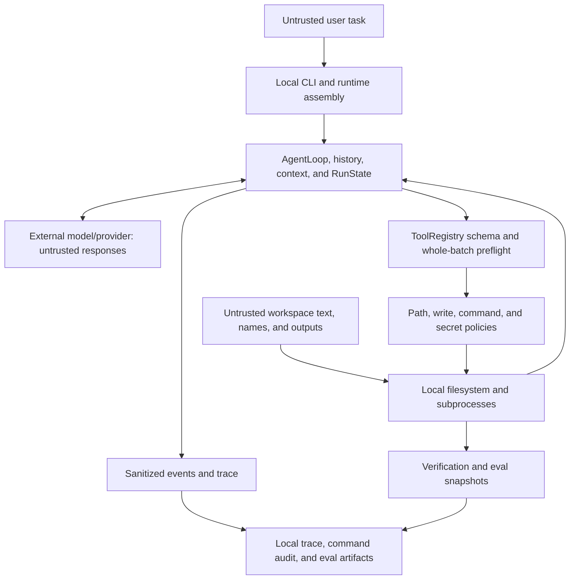

# ProofCoder Threat Model

## 1. Purpose, Scope, and Method

This document models threats to ProofCoder's local agent runtime, its seven local tools, the selected workspace, the model-provider boundary, command execution, traces, evaluation artifacts, repository scans, and offline CI. It uses a lightweight asset, trust-boundary, and abuse-case method informed by STRIDE. It is an engineering review of the current implementation, not a formal security proof, penetration-test report, or certification.

[DESIGN.md](DESIGN.md) describes component architecture, [COMPLIANCE.md](COMPLIANCE.md) maps project rules to implementation evidence, and [EVAL_REPORT.md](EVAL_REPORT.md) records bounded evaluation evidence. This document instead asks how those components can be abused, which local controls constrain that abuse, and what remains exposed.

The source code and tests are the behavior authority for this model. In particular, the model is treated as an untrusted requester. Local Python validation and execution—not model instructions or provider behavior—form the application authorization boundary.

## 2. Security Objectives

ProofCoder aims to:

- keep workspace reads and writes within the user-selected workspace and protect sensitive and internal runtime paths;
- prevent provider credentials and other known secret environment values from reaching tool subprocesses, ordinary terminal output, traces, reports, or committed repository content;
- require every model-requested action to pass the local tool schema, whole-batch preflight, and tool-specific policy;
- execute commands as bounded argv with `shell=False`, a default-deny command policy, closed stdin, a minimal environment, and best-effort process-tree cleanup;
- preserve tool-call/result pairing and avoid side effects from a partially valid tool-call batch;
- derive completion and fresh verification from local observations instead of model claims;
- make malformed, incomplete, or damaged trace and evaluation evidence detectable;
- bound API retries, protocol repair, repeated no-progress behavior, context growth, steps, wall time, output, and artifact sizes; and
- keep CI read-only and free of configured provider credentials and real-model evaluation.

These are risk-reduction objectives. They do not imply that allowed workspace code is isolated, every secret representation is recognized, every race is prevented, or dependencies and external systems are trustworthy.

## 3. Assets

| Asset | Confidentiality, integrity, and availability needs |
| --- | --- |
| Provider API credential | Confidential to the local configuration and provider request path; must not propagate to tools or artifacts; revocable if exposed. |
| Workspace source, tests, and metadata | Reads must be scoped; writes must be intended, atomic where implemented, and reviewable; availability must survive failed edits. |
| Workspace boundary | Canonical path, parent, symlink/reparse-point, file-kind, and sensitive-path decisions must not be model-controlled. |
| Protocol history and `RunState` | Assistant/tool pairing, counters, changed files, warnings, and termination must remain internally consistent. |
| Host and child processes | Command selection, cwd, environment, stdin, lifetime, and captured output must remain bounded; host availability matters. |
| Verification evidence | Exit code, timeout, command kind, cwd, argv, and freshness after the latest tracked edit require integrity. |
| Events, trace, and command audit | Must be sanitized, bounded, ordered, attributable to one run, and clearly marked incomplete after sink failure or parse damage. |
| Eval fixture, attempt workspace, and result artifacts | Materialization and snapshots require path and file-type integrity; attempt and summary persistence must not invent success. |
| Git index and reachable history | Must not silently retain credentials; scan conclusions require complete Git enumeration. |
| CI workflow, token, actions, and dependency lock | Workflow authority should remain read-only; action identities and the lock require review; validation should be reproducible after dependency sync. |

## 4. Trust Boundaries and Data Flow

Tasks, model output, README text, source comments, filenames, test output, and command output can all contain instruction-like content and are untrusted data. The [ToolRegistry](../src/proofcoder/tools/registry.py), [safety modules](../src/proofcoder/safety), tool executors, and local completion logic are the enforcement boundary. The Python process, operating system, installed dependencies, Git implementation, provider transport, and trusted external executables are assumptions or supply-chain boundaries rather than objects ProofCoder isolates.

## 5. Attacker and Failure Model

Relevant threat sources include a malicious or prompt-injected model response; a malicious user task; hostile repository files, comments, tests, filenames, paths, symlinks, reparse points, scripts, or output; crafted command arguments; PATH hijacking; tampered JSONL; malicious fixtures; malicious pull requests or dependency changes; and accidental faults such as timeout, disk failure, encoding errors, interruption, and output floods. The attacker may repeatedly request locally legal operations and may place instruction text anywhere the model reads. The design must not assume that the model will voluntarily honor policy.

The following are not solved by this application model: an attacker who already controls the OS, Python interpreter, or current user account; a compromised provider, package source, GitHub-hosted runner, or operator-trusted executable; kernel isolation for an allowed workspace Python program; a formal proof that no credential exists; or prevention of every local time-of-check/time-of-use race. These exclusions retain real impact: compromise at one of these boundaries can expose the credential, alter evidence, execute with user authority, or invalidate all conclusions.

## 6. Threat Status Definitions

- **Mitigated:** direct production controls and relevant tests exist, while a bounded residual risk remains.
- **Partially mitigated:** important paths are controlled, but a material exposure remains.
- **Accepted boundary:** the design deliberately permits the behavior and requires operator awareness.
- **Detection only:** the implementation can report or invalidate evidence but does not prevent the initiating event.
- **Out of scope:** effective control depends on the OS, supply chain, provider, or other external infrastructure.

No status means “eliminated” or “fully secure.”

## 7. Threat Matrix

| ID | Asset / surface | Threat or abuse case | Main controls | Evidence | Status | Residual risk |
| --- | --- | --- | --- | --- | --- | --- |
| TM-01 | Model context | Workspace or command text prompt-injects the model into changing goals or requesting dangerous actions. | System instruction labels repository/output text untrusted; every action still crosses local schema and policy. | [prompt](../src/proofcoder/prompt.py), [agent tests](../tests/unit/test_agent.py) | Partially mitigated | The model can choose a legal but undesirable action or expose already-read non-sensitive data to the provider. |
| TM-02 | Tool protocol | Unknown tools, malformed JSON, wrong types, unknown fields, or duplicate IDs corrupt history or execute unexpectedly. | Local parsing, schema checks, stable errors, duplicate-ID rejection, and one result per call occurrence. | [registry](../src/proofcoder/tools/registry.py), [tool tests](../tests/unit/test_tools.py), [context tests](../tests/unit/test_context.py) | Mitigated | Provider-native objects and local parser correctness remain trusted code. |
| TM-03 | Multi-call batch | An early valid write executes before a later invalid call is discovered. | All calls, including tool preflight, are prepared before execution; invalid, duplicate, or mixed-finish batches execute none. | [AgentLoop](../src/proofcoder/agent.py), [agent tests](../tests/unit/test_agent.py) | Mitigated | A fully valid batch executes sequentially and a later runtime failure cannot roll back an earlier successful action. |
| TM-04 | Workspace path | Traversal, absolute paths, UNC/drive-qualified Windows paths, or unsafe command path arguments escape the workspace. | Cross-platform absolute/drive rejection, canonical resolution, `relative_to` containment, and command-path validation. | [path safety](../src/proofcoder/safety/paths.py), [file tests](../tests/unit/test_read_file.py), [command-policy tests](../tests/unit/test_command_policy.py) | Mitigated | Filesystem state can change after checks; platform path behavior remains an OS boundary. |
| TM-05 | Links and file types | Symlink/reparse-point or special-file behavior crosses boundaries or defeats snapshots. | Final resolution checks; create checks the parent without following the final component; search skips links; eval rejects links, reparse points, and special files. | [paths](../src/proofcoder/safety/paths.py), [eval fixtures](../src/proofcoder/eval_fixtures.py), [eval tests](../tests/unit/test_eval_core.py) | Partially mitigated | Ordinary tools do not provide a handle-based, race-free filesystem sandbox. |
| TM-06 | Credentials and runtime paths | The model reads or writes `.env`, key material, credential files, or `.proofcoder` artifacts. | Case-insensitive sensitive component rules, protected suffix/name list, `.env.example` exception, and internal runtime-path rejection. | [secret path policy](../src/proofcoder/safety/secrets.py), [path safety](../src/proofcoder/safety/paths.py), [file/edit tests](../tests/unit/test_edit_tools.py) | Partially mitigated | Unknown filenames or secrets stored under ordinary names are not blocked by path classification. |
| TM-07 | File integrity | Create overwrites an existing target; replace is ambiguous, loses encoding/newlines/mode, or races another writer. | Create-if-absent hard link; exact counted replacement; BOM/newline/trailing-newline/mode preservation; staging, digest/metadata recheck, and atomic replace. | [edit tools](../src/proofcoder/tools/edit.py), [write safety](../src/proofcoder/safety/writes.py), [edit tests](../tests/unit/test_edit_tools.py) | Partially mitigated | A race remains between the final recheck and `os.replace`; atomicity is local-filesystem dependent. |
| TM-08 | Command execution | Shell metacharacters or crafted arguments gain shell interpretation. | Schema accepts argv only; policy validates each argument; `Popen` uses `shell=False`, closed stdin, fixed cwd, and no shell string. | [command policy](../src/proofcoder/safety/commands.py), [command executor](../src/proofcoder/tools/command.py), [command tests](../tests/unit/test_run_command.py) | Mitigated | An allowed executable can interpret its own arguments or input files dangerously. |
| TM-09 | Command authority | Unknown commands, downloads, installers, privilege tools, destructive Git, mutation flags, or scope-changing options execute. | Default-deny executable/module/subcommand/option policy; read-only Git forms; network and mutation categories blocked during preflight. | [command policy](../src/proofcoder/safety/commands.py), [policy tests](../tests/unit/test_command_policy.py) | Mitigated | The allowlist must be reviewed whenever commands or options change. |
| TM-10 | Provider credential | API keys enter child environments, argv, terminal, trace, audit, report, or repository. | Environment-backed config with hidden repr; minimal subprocess environment; known-value and pattern redaction; sensitive paths; bounded sanitized events; repository scan. | [config](../src/proofcoder/config.py), [secret handling](../src/proofcoder/safety/secrets.py), [event tests](../tests/unit/test_events.py), [secret-scan tests](../tests/unit/test_secret_scan.py) | Partially mitigated | The key necessarily exists in the local process and provider request; unknown encodings or unrecognized secret formats may evade filters. |
| TM-11 | Host availability | Timeout, descendant processes, stdout/stderr flood, or blocked readers exhaust resources. | Per-command timeout, process group/session, best-effort tree termination, Windows `taskkill.exe` fallback, concurrent capture, 10 MiB audit caps, and 32 KiB returned stream caps. | [command executor](../src/proofcoder/tools/command.py), [run-command tests](../tests/unit/test_run_command.py) | Partially mitigated | Cleanup is best effort; there is no CPU, memory, disk, or kernel sandbox. Exact Windows cleanup argv has manual review rather than a dedicated assertion. |
| TM-12 | Search executable | A malicious workspace or PATH `rg` is executed, or ripgrep floods/hangs. | Only absolute external PATH directories; canonical external regular executable; Windows `.exe` and POSIX execute-bit checks; fixed argv, deadline, independent caps, cleanup, and Python fallback. | [search tool](../src/proofcoder/tools/search.py), [search tests](../tests/unit/test_search_text.py) | Partially mitigated | External ripgrep provenance and signatures remain operator responsibilities. |
| TM-13 | Runtime availability | API retry, protocol correction, failed batches, no-progress behavior, steps, time, or context grow without bound. | Provider SDK retries disabled; local capped retry/backoff; one protocol repair; failure/no-progress thresholds; step/time/context budgets and atomic compaction. | [AgentLoop](../src/proofcoder/agent.py), [retry](../src/proofcoder/retry.py), [D2 tests](../tests/unit/test_agent_d2.py), [context tests](../tests/unit/test_context_manager.py) | Mitigated | Work may still consume the full configured budget, and a malicious sequence can avoid exact no-progress fingerprints. |
| TM-14 | Completion evidence | The model fabricates changed files, verification argv, or completion status. | `VerificationTracker` records actual built-in edit and command results; `finish_task` never runs claimed commands; mismatches warn and local facts win. | [verification](../src/proofcoder/verification.py), [finish](../src/proofcoder/tools/finish.py), [finish tests](../tests/unit/test_finish_task.py) | Mitigated | Local verification proves a command result, not semantic correctness or absence of untracked side effects. |
| TM-15 | Verification freshness | A successful old test remains accepted after a later edit. | Every successful built-in create/replace invalidates `latest_verification`; only successful, non-timeout test/build/static-check observations qualify. | [state](../src/proofcoder/state.py), [verification tests](../tests/unit/test_verification.py) | Mitigated | Normal-run freshness does not independently detect changes made by an allowed script or external process. |
| TM-16 | Trace integrity | Trace write failure, truncation, tampering, malformed JSON, wrong run ID, non-increasing sequence, or missing termination creates false evidence. | Flush per event; recorder disables on failure; run marked incomplete; strict run ID/schema/type/sequence parsing and required termination. | [trace](../src/proofcoder/trace.py), [trace tests](../tests/unit/test_trace.py) | Detection only | JSONL is not authenticated or append-tamper-proof; a local attacker with file authority can rewrite coherent evidence. |
| TM-17 | Eval scoring | Runtime artifacts, workspace pollution, or an agent claim creates a false pass. | Isolated attempt directories; independent before/after SHA-256 snapshots; exact runtime-artifact classification; required/allowed/unexpected changes; independent final validation and complete trace. | [eval core](../src/proofcoder/eval_core.py), [eval-core tests](../tests/unit/test_eval_core.py) | Mitigated | Fixture coverage is limited; ignored artifact classification and hashing do not prove task semantics. |
| TM-18 | Fixture materialization | Malicious fixture paths, links, special files, oversized data, duplicate paths, or nonempty targets overwrite or escape. | Strict JSON fields and canonical POSIX paths; sensitive/runtime path rejection; link/type/size limits; changed-fixture reinspection; empty target and exclusive file creation. | [fixtures](../src/proofcoder/eval_fixtures.py), [fixture tests](../tests/unit/test_eval_fixtures.py) | Mitigated | A valid fixture's Python code is still executed during validation with user authority. |
| TM-19 | Eval persistence | Attempts or summaries are lost, partially written, reordered, or reported successful without durable evidence. | Append/flush/fsync attempts JSONL; atomic summary replacement; deterministic order; persistence errors fail the session; trace normalization re-reads evidence. | [eval runner](../src/proofcoder/eval_runner.py), [runner tests](../tests/unit/test_eval_runner.py) | Mitigated | Local disk failure can destroy availability, and artifacts are not cryptographically signed. |
| TM-20 | Git credential history | A secret removed from the working tree remains staged or reachable in Git history. | Scanner separately enumerates Git-visible working tree, index blobs, and all reachable history; incomplete enumeration is an error; findings expose metadata, not matched values. | [secret scanner](../src/proofcoder/secret_scan.py), [secret-scan tests](../tests/unit/test_secret_scan.py) | Detection only | Detection does not revoke a credential or safely rewrite published history. |
| TM-21 | Scanner accuracy | Pattern scanning yields false negatives, false positives, or a misleading pass after limits/decoding failures. | Explicit path/content rules, placeholder handling, bounded scopes, `scan_complete`, and non-pass exit on errors or limits. | [secret scanner](../src/proofcoder/secret_scan.py), [secret-scan tests](../tests/unit/test_secret_scan.py) | Detection only | Encoded, fragmented, novel, ignored, unreachable, or externally stored secrets may be missed. |
| TM-22 | CI and supply chain | A malicious PR, action, dependency, package source, runner, or lock change executes hostile code. | `contents: read`; checkout full history with credentials not persisted; action commit-SHA pins; locked sync; subsequent checks use `uv run --offline`; no provider key or real eval configured. | [CI workflow](../.github/workflows/ci.yml), [compliance checker](../src/proofcoder/compliance.py), [compliance tests](../tests/unit/test_compliance.py) | Partially mitigated | Dependency sync uses network/package-source trust; PR code and lock changes execute on a runner. CI success is evidence, not proof. |
| TM-23 | Allowed Python script | The model runs an allowlisted workspace `.py` file that performs arbitrary OS actions. | Script path must be a regular workspace file; argv, cwd, environment, timeout, output, and process handling remain constrained; limitation is disclosed in the tool schema. | [command policy](../src/proofcoder/safety/commands.py), [policy tests](../tests/unit/test_command_policy.py) | Accepted boundary | The script has current-user authority and can access resources outside application path policy. |
| TM-24 | Platform/provider compromise | OS, interpreter, current account, provider, trusted executable, package source, or runner is compromised. | No complete local control; minimize privileges, review provenance, and rotate credentials after exposure. | [COMPLIANCE limitations](COMPLIANCE.md#11-security-boundaries-and-limitations) | Out of scope | Such compromise can bypass policy, alter evidence, or disclose credentials. |

## 8. Prompt Injection Analysis

The user task, README, source comments, tests, filenames, test output, and command output may all contain imperative text. The system prompt's instruction to distrust repository text is useful only as a first layer. Authorization remains in the local `ToolRegistry`, whole-batch preflight, path and command policies, bounded executors, verification tracker, and completion logic.

Those controls constrain how a request executes; they do not guarantee good judgment. The model may select a legal but unnecessary read, edit, or test. Most importantly, an allowed workspace Python script can use current-user OS authority beyond ProofCoder's file-tool rules. ProofCoder therefore does not claim to solve prompt injection completely.

## 9. Filesystem and Write Analysis

File tools require workspace-relative paths and reject POSIX absolute paths, native absolute paths, Windows drives, resolved escapes, sensitive components, and `.proofcoder`. Existing file reads require regular files; create resolves and validates the existing parent while refusing any lexically existing target, including broken links. Eval adds explicit reparse-point and special-file rejection.

`create_file` stages bytes beside the target and publishes with create-if-absent hard-link semantics. `replace_in_file` reads bounded UTF-8, captures file identity, metadata, and SHA-256, requires the exact non-overlapping match count, preserves BOM, newline behavior, trailing-newline state, and mode where supported, then rechecks and atomically replaces. This narrows but does not remove TOCTOU between final recheck and commit.

Normal-run changed-file tracking records successful built-in create/replace result paths. It is not a complete filesystem monitor. Evaluation compensates with independent snapshots that include additions, modifications, and deletions before applying exact required/allowed scope rules.

## 10. Command and Process Analysis

`run_command` accepts an argv array only. The policy resolves a narrow set of Python, pytest, Ruff, unittest, compileall, and read-only Git forms; validates cwd and path-bearing options; blocks shell wrappers, inline/stdin Python, downloads, installers, privilege changes, destructive Git, mutation flags, and unknown commands. Execution uses `shell=False`, closed stdin, a sanitized absolute-only PATH, a minimal noninteractive environment, timeouts, bounded concurrent stream capture, redaction, and best-effort group/tree cleanup. Windows cleanup may invoke the local `System32/taskkill.exe` with a child PID; POSIX uses process-group signals.

Search applies a separate hardened ripgrep resolver and falls back to in-process Python search when the optional backend is unsafe or unhealthy. None of these mechanisms is an OS sandbox. Allowed repository Python code, a trusted executable, or compromised dependencies can act with current-user privileges.

## 11. Credential, Logging, and Trace Analysis

The provider key must be read into local configuration and supplied to the provider client; it cannot honestly be described as “never read.” It should not enter tool environments, argv, terminal output, traces, reports, command audits, Git, or evaluation metadata. Configuration hides the key from repr, subprocesses receive only allowlisted environment names, output passes exact-value and/or pattern redaction, sensitive file paths are blocked, and repository scanning covers declared Git surfaces.

Ordinary events omit `reasoning_content`, environment/headers, raw request/response, full file bodies, and stdout/stderr. Create/replace argument events retain sizes and SHA-256 rather than content. Diffs are redacted previews; command events retain bounded metadata, while command audit retains bounded redacted streams. A trace write failure disables that recorder, emits a safe warning when possible, and makes the run/eval evidence incomplete. Redaction and scanning remain pattern-based and cannot establish that unknown secret formats are absent.

## 12. Protocol, Completion, and Availability Analysis

`MessageHistory` enforces legal ordering and pending tool-result counts. `AgentLoop` rejects duplicate IDs and mixed `finish_task` batches, preflights the full batch, executes valid calls synchronously, and supplies results for interrupted or unstarted calls. Context compression removes whole assistant/tool groups and terminates if required context cannot fit.

API retry is limited to classified transient failures and capped attempts, delay, and remaining wall time. One no-tool response gets one protocol repair; failed-batch, no-progress, step, time, and context limits provide other finite termination paths. Ctrl+C, permanent provider failure, malformed required context, and internal failure terminate with local reasons and attempt to persist a termination event. When the provider is unavailable, no local tool request is invented.

Only successful, non-timeout test/build/static-check commands become verification. A later built-in modification invalidates them. `finish_task` is explanatory input: its claimed command is never executed, and its claimed files or status cannot override local facts.

## 13. Evaluation and CI Analysis

Fixtures have a strict schema, bounded content, canonical paths, an expected failing initial state, and a configured `success_exit_code`. Each attempt uses an isolated workspace, independent initial/final validation, before/after snapshots, exact file-scope checks, and a normalized complete trace. Runtime artifacts are security-checked before exact classification and exclusion. Attempts are appended and synced; summaries are atomically replaced.

CI checks out full history for scanning, grants only `contents: read`, disables persisted checkout credentials, and pins actions to commit SHAs. Locked dependency synchronization still crosses the package-source/network boundary. Format, lint, tests, offline doctor, compliance, and secret scan then use offline uv execution. The workflow configures no provider key, makes no real-model evaluation, and uploads no artifact. A malicious PR may change code and the lock and thereby execute code during install or tests, but cannot obtain an unconfigured provider secret or repository write permission from this workflow.

## 14. Residual Risks and Operator Responsibilities

Operators should run ProofCoder only on workspaces they are willing to expose to the configured provider and execute locally. They should review any workspace Python script before allowing it to run; use trusted Python, uv, dependency sources, Git, and ripgrep; use a minimal-privilege, low-quota provider key; preserve `.env` ignore rules; run the repository secret scan before committing; inspect incomplete-trace and audit warnings; and review dependency, lock, action, and workflow changes.

ProofCoder must not be treated as a sandbox. If a credential may have leaked, revoke and rotate it immediately without displaying its value. Release-process rules such as a post-deadline zero-push requirement are operator controls, not runtime enforcement.

## 15. Security Invariants for Future Changes

- Every model-requested action remains locally schema-validated and whole-batch-preflighted, with one matching result per tool-call occurrence.
- Workspace writes retain canonical containment, sensitive/runtime path checks, bounded content, and negative tests.
- Commands remain argv-only, `shell=False`, default-deny, time-bounded, output-bounded, and secret-minimized.
- Provider credentials never propagate to tool environments or ordinary artifacts.
- Every successful tracked edit invalidates prior verification; model completion claims remain non-authoritative.
- New trace fields pass sanitization and size limits; eval success still requires independent validation and a complete trace.
- New dependencies do not introduce agent frameworks, agent SDKs, hosted execution, or hosted file access.
- Every new tool receives tests for its closest unsafe paths, malformed schema, sensitive data, output limits, and interruption behavior.
- CI remains provider-secret-free, read-only, pinned, and offline after dependency synchronization.

## 16. Review Triggers and Incident Response

Repeat threat modeling when adding a tool or allowed command, provider/client, concurrency or streaming, a write mechanism, trace field, eval category, external executable, dependency, or workflow permission; when making an OS-sandbox claim; or when discovering a real credential exposure or out-of-workspace write.

For secret exposure, revoke and rotate first and never reproduce the value in a report. For an unexpected write, stop the run and preserve the trace and local filesystem evidence. For trace corruption, mark the run incomplete and exclude it from success. For CI or supply-chain anomalies, stop release, verify lock and action SHAs, and inspect provenance. Do not “fix” an incident by weakening a checker, deleting failed evidence, or rewriting a report to claim success.
